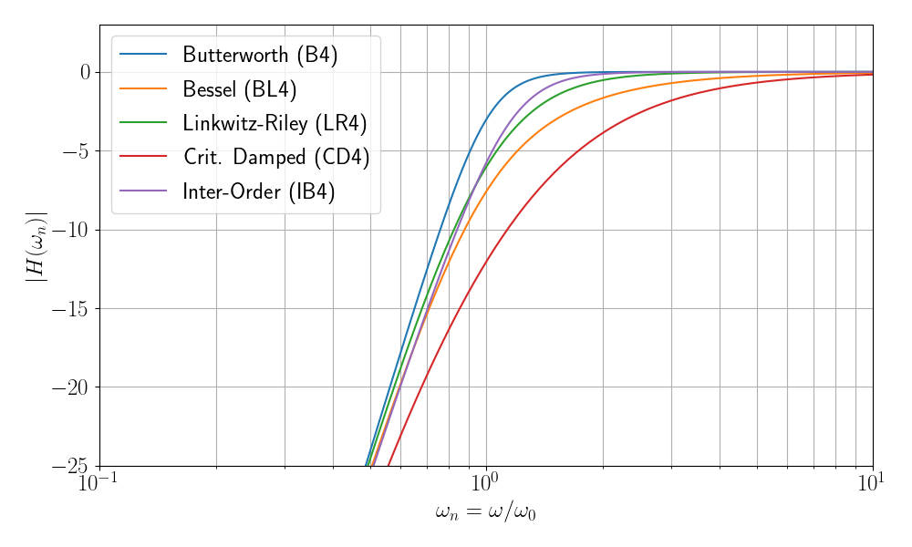
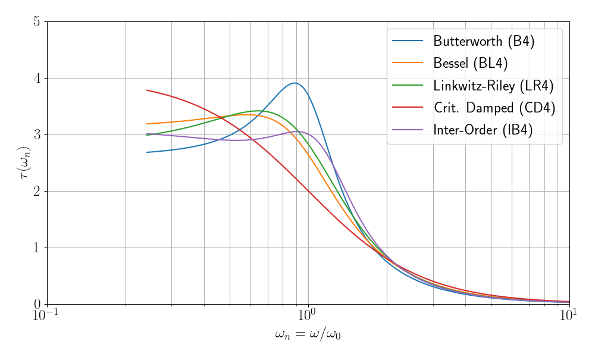

.. meta::
   :author: Jeff Candy and Claus Futtrup
   :keywords: speakerbench,loudspeaker,driver,parameter,json,design,calculator,impedance,measurement,simulation,software,free,audio
   :description: Speakerbench Documentation

=========================
Classic Vented Alignments
=========================

In classical loudspeaker theory from the 1960s onwards, the concept of alignments was developed to provide a systematic prescription for choosing box volume and port tuning to yield a target low-frequency response. While the theory is not exact, it offers numerous benefits including insight into the choice between low frequency extension versus group delay (phase distortion). For a brief overview of the alignments discussed here and supported in Speakerbench, please scroll down to the :ref:`Summary` section at end of this page. Because this section is potentially confusing, we outline the overall structure as

1. General framework (key equations)
2. Discrete alignments (B4,BL4,LR4,IB4,CD4)
3. Alignment families (C4,BB4)
4. Misalignment families (quasi and compliance alteration)

General framework
-----------------

To facilitate choosing the box volume and vent tuning, Speakerbench will propose values based on standard 4th-order bass-reflex alignments. These alignments are particular types of 4th-order high-pass filters. Following Small :cite:`small:1973c` (Eq. 57) we can write the normalized response function as

.. math::
   :label: eq.response
	   
   G_\mathrm{H}(s) = \frac{s^4}{s^4 + a_1 s^3 + a_2 s^2 + a_3 s + 1} \; ,

where :math:`s = j \omega / \omega_0` is the dimensionless complex frequency variable normalized to :math:`\omega_0 \doteq \sqrt{\omega_B \, \ws}`. In the first part of his article series, Small :cite:`small:1973c` (Eqs. 22--24) writes the lossy box filter coefficients as

.. math::
   \displaystyle
   a_1 & = \frac{\ql + h \: \qts}{\sqrt{h} \: \ql \: \qts}  \\
   a_2 & = \frac{h + (\alpha + 1 + h^2) \: \ql \: \qts}{h \: \ql \: \qts} \\
   a_3 & = \frac{h \: \ql + \qts}{\sqrt{h} \: \ql \: \qts} \; ,

where :math:`\ql` is the leakage-loss :math:`Q` of the box and :math:`\qts` is the total :math:`Q` of the driver. Here, :math:`h = \omega_B/\ws` is the system tuning ratio and :math:`\alpha = V_{AS} / V_B` is the ratio of the compliance volume to the box volume. We remark that the coefficients are approximate and neglect myriad other terms which appear in a more comprehensive model of a vented box. These missing terms would represent more complex losses in the box and in the driver suspension system, driver inductance and semi-inductance, and so on. In the definition of :math:`\omega_0`, :math:`\ws` is the driver resonant frequency and :math:`\omega_B` is the vent resonant frequency. This normalization is equivalent to setting :math:`T_0=1` in Small's expressions. The magnitude-versus-frequency behavior is also given in Small :cite:`small:1973c` (Eqs. 58 and 59), which we reproduce here as

.. math::
   \left| G_\mathrm{H}(i\omega) \right|^2 = \frac{\omega^8}{\omega^8 + A_1 \omega^6 + A_2 \omega^4 + A_3 \omega^2 + 1} \; ,

where

.. math::
  A_1 & = a_1^2-2 a_2 \; , \\
  A_2 & = a_2^2+2-2 a_1 a_3 \; , \\
  A_3 & = a_3^2-2 a_2 \; .

Discrete alignments
-------------------

A *discrete* bass reflex alignment means we need to select a driver with a specific :math:`\qts` value and match that with a specific box volume and port tuning frequency to obtain the unique discrete alignment. Two popular classic discrete alignments are the Butterworth (B4) and Bessel (BL4) ones. In addition, Thiele (reference) defined the Inter-Order Butterworth (IB4) discrete alignment around 1974. In these notes we further discuss the so-called Linkwitz-Riley (LR4) and Critically Damped (CD4) discrete alignments. Each discrete alignment defines a specific 4th-order filter with fixed coefficients :math:`(a_1,a_2,a_3)` along with properties that are broadly suitable for vented aligments. The coefficients are

Butterworth B4
^^^^^^^^^^^^^^

.. subfigure:: A
   :width: 40%
   :gap: 6px
   :align: center
   :name: fig.B4

   .. image:: example_code/B4-poles.png

   B4 poles.

The Butterworth filter response was first described by Stephen Butterworth around 1930. This filter offers a maximally-flat frequency response (with no ripple in the passband) offers the sharpest knee point towards the roll-off region and thus the most extended bandwidth. In relation to bass reflex loudspeakers, B4 was a very popular target response for many years, and several (non-discrete) alignment *families* ultimately develops from B4. The amplitude response function 

.. math::
   G_\mathrm{H}(s) = \frac{s^4}{s^4 + 2.613 s^3 + 3.141 s^2 + 2.613 s + 1} \; ,

The filter coefficients depend on cosines of the pole locations, and have the exact values

.. math::
   a_1 = 2 \cos\frac{\pi}{8} + 2 \cos\frac{3\pi}{8} \qquad
   a_2 = 2+4 \cos\frac{\pi}{8} \cos\frac{3\pi}{8}  \qquad
   a_3 = a_1

The remarkable vanishing of all coefficients :math:`(A_1,A_2,A_3)` demonstrates the maximally-flat property via 
 
.. math::
   \left| G_\mathrm{H}(i\omega) \right|^2 = \frac{\omega^8}{\omega^8 + 1} \; ,

Bessel BL4
^^^^^^^^^^

The Bessel response is written in terms of the Bessel polynomials introduced by Friedrich Wilhelm Bessel (1784 -1846). The practical application to filters was worked out by W.E. Thomson in 1949 in a scientific article titled *Delay Networks Having Maximally Flat Frequency Characteristics*. Thomson described this filter function applied to delay lines. Low-pass Bessel filters are characterized by the fastest settling time and maximally flat group delay of the form :math:`D \sim 1 + O(\omega^8)`. A frequency range with flat group delay implies nearly linear phase response and hence minimal phase distortion of the signal.

.. math::
   G_\mathrm{H}(s) = \frac{s^4}{s^4 + 3.201 s^3 + 4.392 s^2 + 3.124 s + 1} \; ,

The filter coefficients are derived from the Bessel polynomial :math:`y_4(x) = 105 x^4 + 105 x^3 + 45 x^2 + 10 x + 1`, and have the exact forms

.. math::
   a_1 = \frac{105}{105^{3/4}} \qquad a_2 = \frac{45}{105^{1/2}} \qquad a_3 = \frac{10}{105^{1/4}} \; .

Linkwitz-Riley LR4
^^^^^^^^^^^^^^^^^^

The Linkwitz-Riley filter response was described by Siegfried H. Linkwitz in 1976 as two cascaded Butterworth filters, which poses the desirable feature as a crossover between two non-coincident transducers, that they sum in-phase. In relation to bass reflex alignment, we are not crossing to another driver, but the LR4 alignment poses some desirable features like fast settling time (nice impulse response) similar to the BL4 alignment and a more extended frequency response when compared with the BL4 alignment. The response function is:

.. math::
   G_\mathrm{H}(s) = \frac{s^4}{s^4 + 2.8284271 s^3 + 4 s^2 + 2.8284271 s + 1} \; ,

Critically damped CD4
^^^^^^^^^^^^^^^^^^^^^

.. comment:
   I don't think this is true: We remind ourselves that a bass reflex system consists of two oscillators: 1) the driver in the box, and 2) the port in the box, and each of these two 2nd-order systems must be critically damped, i.e., have a filter :math:`Q = 0.5`, which means they are LR2 filter functions.

A critically-damped response has all 4 poles at :math:`s=-1`, such that the response function is 

.. math::
   G_\mathrm{H}(s) = \frac{ s^4 } { (s + 1)^4 } = \frac{s^4}{s^4 + 4 s^3 + 6 s^2 + 4 s + 1} \; .

Because of the reality of the poles, the step response for a CD4 aligment is non-oscillatory (no overshoot). Thus, CD4 is the most extended frequency response of all alignments with no overshoot. In relation to bass reflex design, however, this alignment is not commonly used due to the early roll-off in the frequency response. We remark that CD4 is also a special case of the :ref:`Boombox BB4` family for :math:`\zeta = 1`. CD4 is also equivalent to two cascaded 2nd-order filters each with :math:`\qfilt = 0.5`, where :math:`\qfilt` is the filter-Q

.. math::
   s^2+s/\qfilt+1 \; .

In the lossless case :math:`\ql \rightarrow \infty`, the CD4 alignment corresponds to a driver with :math:`\qts = 0.25`.  A discussion of the CD4 alignment was presented in Voice Coil Magazine in August 2024. Later the article became Open Access when AudioXpress released an `online version October 2024 <https://audioxpress.com/article/the-cd4-bass-reflex-alignment>`_.

Inter-Order Butterworth IB4
^^^^^^^^^^^^^^^^^^^^^^^^^^^

The fourth-order Inter-Order Butterworth high-pass filter is defined by A. N. Thiele as a combination of a second-order and two identical first-order filters. Two cascaded first-order 'Butterworth' filters become a second-order Linkwitz-Riley filter function. The other second-order term is defined by targeting a maximally flat 4\ :sup:`th`-order response. When compared to the LR4 response, an IB4 alignment will have a bit more extended response, then a sharper knee and faster roll-off (similar to a maximally flat response, but within what's obtainable with the constraint of two first-order filters). The two first-order filters place two of the poles on the real axis. The response function is:

The Inter-Order Butterworth (IB4) alignment is rarely talked about. It was mentioned briefly by Richard Small :cite:`small:1973c`. Bullock :cite:`bullock:1981` published a table for this discrete alignment, and the tables are reproduced in The Loudspeaker Design Cookbook by Vance Dickason.

The IB4 alignment and the mathematics behind, was first presented in Voice Coil Magazine, July 2024. Later the article became Open Access when AudioXpress released an `online version October 2024 <https://audioxpress.com/article/the-ib4-bass-reflex-alignment>`_.

.. math::
    G(s) = \frac{ s^4 } { (s^2 + 2 \cdot \kappa \cdot s + \lambda) \cdot (s + 1)^2 }

For our application, the polynomial must be manipulated into a suitable normalized form for identification of the polynomial coefficients, which is achieved when :math:`\kappa = \sqrt{2 \cdot (\sqrt{3} - 1)}` and :math:`\lambda = \sqrt{3}`. With the mentioned special coefficients, the polynomial coefficients :math:`a_1`, :math:`a_2`, and :math:`a_3` and the normalized response function can be calculated. 

The coefficients of the normalized polynomial based on :math:`\kappa` and :math:`\lambda` are calculated in the algorithm below. 

For leakage :math:`\ql = \infty`, the driver :math:`\qt` that matches
the Inter-Order Butterworth response function is :math:`0.3398 \approx 0.34`.

The IB4 alignment is a specific case of the B4Q (QB3) alignment.

Comparison
^^^^^^^^^^

:numref:`discrete_spl` and :numref:`discrete_gd` shows the (normalized) magnitude response and group delay response of the above mentioned discrete alignments.

            The normalized magnitude response of the discrete alignments.

            The normalized group delay response of the discrete alignments.

Note: These graphs are **not** normalized relative to the driver's resonance frequency, but :math:`\omega_0 \doteq \sqrt{\omega_B \, \ws} = \sqrt{h} \cdot \ws`.

Modification of discrete alignments 
-----------------------------------

For the discrete alignments, :math:`\qts` is not a free parameter. In practice you need to consider what to do if you have a preferred discrete alignment but the driver is *misaligned* -- that is, if the driver :math:`\qts` does not match that required by your target alignment. 

For example, consider the 4th-order Butterworth. In the section below we will describe three misalignment options for B4; namely, B4i (method of ignorance), B4Q (quasialignment), and B4CA (compliance alteration). These options also appear in the Speakerbench Alignment Chart. The three will converge to a single point in the chart (the same alignment) as your driver :math:`\qts` approaches the :math:`\qts` value for B4. On the other hand, when the driver :math:`\qts` is far from the target :math:`\qts`, the three methods will be far from each other and also probably undesirable as an alignment. 

(1) Method of ignorance
^^^^^^^^^^^^^^^^^^^^^^^

The simplest solution is to ignore the fact that the driver :math:`\qts` is far from the target :math:`\qts`. This we call the method of ignorance, because you ignore the fact that :math:`\qts` is wrong. Speakerbench denotes this approach by adding a trailing 'i' to the name: B4i, LR4i and BL4i. In this case, the suggested :math:`h` and :math:`\alpha` are **unaffected** by the driver :math:`\qts` (the fact that :math:`\qts` is not correct is ignored). The method of ignorance **is not recommended for actual use**, but is included for reference. Despite the name, We suspect that this method was commonly used in the past.

(2) Method of compliance alteration
^^^^^^^^^^^^^^^^^^^^^^^^^^^^^^^^^^^

Another approach to handling the situation where the driver :math:`\qts` isn't matched perfectly, is to assume the misalignment (or error) is due to the driver suspension being either too soft or too stiff, i.e., that the driver compliance is imagined to be altered such that the target :math:`\qts` value for the target alignment is met.

Compliance Alteration is computed by first 1) Calculating the reference :math:`Q_\mathrm{Tref}` for your target and the resulting :math:`\alpha_\mathrm{ref}` and :math:`h_\mathrm{ref}`, then 2) shift :math:`\alpha` and :math:`h` relative to the :math:`\qts` for the actual driver at hand in the following way:

.. math::
   \begin{eqnarray}
   \alpha &=& \alpha_\mathrm{ref} \cdot \Big( \frac{Q_\mathrm{Tref}}{\qts} \Big)^2 \; , \\
   h &=& h_\mathrm{ref} \cdot \frac{Q_\mathrm{Tref}}{\qts} \; .
   \end{eqnarray}

In Speakerbench, when we apply this method, the alignment acronym is followed by 'CA' as in B4CA, LR4CA and BL4CA.

**Source code**

.. code-block:: python

  import numpy as np

  def ca_shift(Qtref,Qt,aref,href):
      """Function calculating Compliance Alteration parameter shift"""
      h_out = href * Qtref/Qt
      alpha_out = aref * (Qtref/Qt)**2
      return h_out,alpha_out

  Ql = 10
  Qtvec=[0.34,0.36,0.38,0.40,0.42]

  Qt = 1./(1./np.cos(3*np.pi/8)-1./Ql)
  h_ref = 1
  a3 = np.sqrt(8)*np.cos(np.pi/8)
  alpha_ref = np.sqrt(2) - (1/Ql**2) * (a3*Ql-1)

  print('           B4CA')
  print(' Qts     h    alpha ')
  print('-----  -------------')

  for i,Qts in enumerate(Qtvec):
     h,alpha = ca_shift(Qt,Qts,alpha_ref,h_ref)
     print('{:.3f}  {:.4f} {:.4f}  '
        .format(Qts,h,alpha)   )

**Output**

::

             B4CA
   Qts     h    alpha
  -----  -------------
  0.340  1.1703 1.5928
  0.360  1.1053 1.4207
  0.380  1.0471 1.2751
  0.400  0.9948 1.1508
  0.420  0.9474 1.0438

Compliance Alteration was first presented in Voice Coil Magazine, October 2024. Later the article became Open Access when AudioXpress released an `online version January 2025 <https://audioxpress.com/article/bass-reflex-alignments-compliance-alteration>`_. It can be applied to any target response function of your choice. This method is particularly interesting if your driver :math:`\qts` is a bit too high, because with the compliance alteration technique, the box calculation is then treated as if the suspension is a bit too stiff. Fortunately, the driver suspension will experience aging (or burn-in) over time and will soften. When this happens, the provided equations dictate that your system will, over time, move toward the desired target response, and if softened enough to reach :math:`Q_\mathrm{Tref}`, it drops into place and becomes a correct response without any error.

Generalized quasi-alignments
^^^^^^^^^^^^^^^^^^^^^^^^^^^^

In a design process based on alignments, we consider :math:`(\ql,\qts)` as given inputs and :math:`(\alpha,h)` as output parameters to be computed by the alignment. Since we have two free parameters, it follows that we can specify only two of the three values :math:`(A_1,A_2,A_3)`. The approach taken is to relax (i.e., ignore) the condition on :math:`A_3`; that is, we match the behaviour in the pass-band :math:`(A_1)` and mid-band :math:`(A_2)` but **not** the stop-band :math:`(A_3)`. This is described in more detail for so-called QB3 (although we prefer B4Q because the order of the filter is 4) lossless case by Benson :cite:`benson:1993` (page 188).

By defining :math:`G = \left( \alpha+1+h^2 \right)/h`, we can rewrite these two conditions as

.. math::
  \begin{eqnarray}
  A_1 &=& \frac{q^2}{h} - 2G + \epsilon^2 q^2 h \; , \\
  A_2 &=& \left( G + \epsilon q^2 \right)^2 + 2-2q^2\left[ 1+\epsilon^2+\epsilon (h+1/h) \right] \; .
  \end{eqnarray}

where :math:`q = 1/\qts` and :math:`\epsilon = \qts/\ql \ll 1` is a small parameter.

**Recursive solution**

In the limit :math:`\epsilon = 0`, we can solve explicitly for :math:`(G,h)`, and this uniquely determines :math:`(\alpha,h)`. However, an explicit solution is not possible in the case :math:`\epsilon >  0`. But since :math:`\epsilon` is small, we expect the following recursion to converge in a few iterations:

.. math::
   \begin{eqnarray}
   G &=& -\epsilon q^2 + \sqrt{A_2-2+2q^2 \left[ 1+\epsilon^2+\epsilon\left(h+1/h\right)\right]} \\
   h &=& \frac{q^2}{2G + A_1-\epsilon^2 q^2 h}
   \end{eqnarray}

Once converged, we can obtain :math:`\alpha` according to

.. math::
   \alpha = Gh-\left(1+h^2\right)

Finally, note that by setting :math:`\epsilon=0` above we obtain the lossless solution explicitly.

.. collapse:: CLICK HERE to expand quasi source code
   
   .. literalinclude::
      example_code/quasi.py

.. literalinclude::
   example_code/quasi.txt

In Speakerbench, when we apply this method, the alignment acronym is followed by a 'Q' as in B4Q, LR4Q and BL4Q. Be aware, the B4Q in Speakerbench is the same as what is known in classical theory as the QB3 alignment.

Note: Bullock :cite:`bullock:1981` defines SQB3 as a continuation of the QB3 alignment, but for drivers with :math:`\qt > 0.4` and up to 0.56.

This particular implementation of the Quasi algorithm was first presented in Voice Coil Magazine, January 2025.

A special (discrete) alignment named the Inter-Order Butterworth (IB4) alignment was described by Thiele.

Alignment families
------------------

Beyond discrete aligments, for which :math:`(a_1,a_2,a_3)` have explicit numerical values, well-known **alignment families** exist for which :math:`(a_1,a_2,a_3)` depend upon a free parameter. An alignment family allows one to cover a range of driver :math:`\qtss` values rather than just a single value. The B4Q quasi-alignment described above is in the loudspeaker industry considered an alignment family. Small and others refer to this family as QB3 (references).

Chebyshev C4
^^^^^^^^^^^^

Perhaps the most remarkable of all vented alignments is the Chebyshev (C4) method. Chebyshev-like alignments for loudspeakers were exploted as early as 1956 by F.J. van Leeuwen :cite:`vanleeuwen:1956`. These alignments have also been discussed by Thiele and Small, and in detail by Benson following the treatment by Weinberg (expand). The alignment is named after Pafnuty Chebyshev because the amplitude response is written in terms of the Chebyshev polynomial of the first kind. Consider the 4th-order low-pass case,

.. math::
   \left| G_\mathrm{H}(i\omega) \right|^2 = \frac{1}{1+\varepsilon^2 T_4^2 (x)}

where :math:`x = \omega/\omega_c` and :math:`\omega_c` is the critical frequency above which the filter becomes non-oscillatory, and 

.. math::
   T_4(x) = 8 x^4 - 8 x^2 + 1 \quad \text{such that} \quad T_4(\cos\phi) = \cos(4\phi)

Thus, in the region :math:`x \leq 1` the properties of polynomial ensure that the amplitude is bounded by   

.. math::
   \frac{1}{1+\varepsilon^2} \leq \left| G_\mathrm{H}(i \omega) \right|^2 \leq 1 \; .

Thus, :math:`\varepsilon` is a measure of the passband ripple. It provides the degree of freedom required for drivers of varying :math:`\qts`. Note however that the response functions above are not yet written in the canonical form of Eq. :eq:`eq.response`. Using the properties of the Chebyshev polynomials one can determine the locations of the poles :math:`u = i x = i \cos\phi` (the analog of :math:`s = i\omega`) by finding the roots of

.. math::
   1+\varepsilon^2 \cos\left(4\phi\right)^2 = 0

After some algebra we can write the roots as

.. math::
   u_m = i\cos\phi_m = - \sinh(\varphi)\sin\theta_m + i \cosh(\varphi)\cos\theta_m \quad\text{for} \quad m = 1,\cdots,4

where :math:`\theta_m = (2m-1)\pi/8` and

.. math::
   \varphi = \frac{1}{4}\,  \mathrm{arcsinh}\left( \frac{1}{\varepsilon} \right)

We can further simplify by defining :math:`s = u/\cosh\varphi` to give 

.. math::

   s_m = -k \sin\theta_m + i \cos\theta_m

where :math:`k = \tanh\varphi < 1`. These are evidently the poles of the B4 alignment, but with the real part multiplied by :math:`k`, which is consistent with a comment by Small. The algebra required to simplify is straigthforward but tedious. Some partial steps are illuminating, specifically

.. math::
   (s-s_1)(s-s_4) & = s^2 + 2 k s \sin\frac{\pi}{8} + 1 + (k^2-1)\sin^2\frac{\pi}{8} \\
   (s-s_2)(s-s_3) & = s^2 + 2 k s \cos\frac{\pi}{8} + 1 + (k^2-1)\cos^2\frac{\pi}{8} \\
   
.. math::
   \prod_{m-1}^4 (s-s_m) = s^4 + k c_0 \, s^3  + \left[ 1+k^2(1+\sqrt{2}) \right] s^2 + k c_0 \left( 1+\frac{k^2-1}{\sqrt{8}} \right) s + D(k)
   
where :math:`c_0 = \sqrt{4+\sqrt{8}}`. Finally we can renormalize to find the forms reported by Small for the high-pass function

.. math::
   a_3 & = \frac{c_0 k}{D^{1/4}} \\
   a_2 & = \frac{1+k^2(1+\sqrt{2})}{D^{1/2}} \\
   a_1 & = \frac{c_0 k}{D^{3/4}} \left( 1+\frac{k^2-1}{\sqrt{8}} \right)

Evidenty, these functions can be analytically continued triivally to the region :math:`k \geq 1`. The region :math:`k < 1` has passband ripple, the special case :math:`k = 1` is the B4 alignment, and the region :math:`k > 1` is monotonic.

.. collapse:: CLICK HERE to expand C4 source code
   
   .. literalinclude::
      example_code/c4solve.py

.. literalinclude::
   example_code/c4solve.txt
      
   
Boombox BB4
^^^^^^^^^^^

The Boombox family of alignments was first described by W.J.J. Hoge in 1976. This alignment is relatively simple, and cascades two identical 2nd-order polynomials according to 

.. math::
   G(s) = \frac{ s^4 } { \left( s^2 + 2 \, \zeta \, s + 1 \right)^2 }

where :math:`\zeta` is the **damping ratio**, which is directly related to the driver's :math:`\qts`-value. For the lossless case, :math:`\zeta = 1 / (4 \qts)`. BB4 is a symmetric alignment such that, :math:`h=1`, and 

.. math::
   alpha = \frac{1}{4} \left( \frac{1}{\qts} - \frac{1}{\ql}\right)^2

The lowest :math:`\ql`-value that Bullock :cite:`bullock:1981` presents is 3, but even that is border-lining exceptionally bad; meanwhile, one would be hard-pressed to find a driver with :math:`\qts = 3` (it could be reached with significant DC resistance in series with the driver, but only if the driver's :math:`\qms`-value is even higher).

Hoge was focused on a suitable alignment for instrument loudspeakers, e.g., for electric guitars, and was seeking a better bass reflex alignment option for the high :math:`\qts`-drivers of the time than the classical Chebyshev C4-alignment. Choosing to cascade two identical 2\ :sup:`nd`-order polynomials gives double poles and therefore a nicer group delay (quantify) with a reasonably fast settling time for an impulse. Unfortunately, this alignment creates a peak before roll-off (when), which led Hoge to satirically name it the Boombox alignment, or BB4. Hoge only defined the BB4 alignment for driver :math:`\qts` above ca. 0.37, and he identified the peak with :math:`\ql = 7` for a driver :math:`\qts = 0.72` to be around +6 dB. For high :math:`\qts` drivers, the peak becomes large, which you might accept in favor of the impulse stopping quicker than a similar peaky Chebyshev response. Besides, the single peak of a BB4 alignment is easier to equalize electronically, than the ripples of a Chebyshev alignment. On the other hand, a Chebyshev alignment with a similar driver :math:`\qt` results in 1.3 - 1.4 dB ripple. Finally, when driver :math:`\qts` is this high, one may consider a large closed box.

Bullock realized that the equations also work well for drivers with lower :math:`\qts`, and in this case there is no peak in the frequency response. He coined the term Sub-Boombox for these alignments, or SBB4, and his tables go as low as :math:`\qts = 0.20`. It is therefore reasonable to say that the BB4-SBB4 alignment works for driver :math:`\qts` in the range of 0.20-0.72, although mathematically it can be applied outside these limits. Note finally that we get LR4 and CD4 are special cases.

Transitional Alignments
^^^^^^^^^^^^^^^^^^^^^^^

To the best of our knowledge, the concept of Transitional Alignments was never explored in relation to loudspeaker (Bass Reflex) boxes until it was presented in the Voice Coil Magazine, September 2024. Later the article became Open Access when AudioXpress released an
`online version December 2024 <https://audioxpress.com/article/transitional-bass-reflex-alignments>`_.

Notably, R. M. Golden and J. F. Kaiser :cite:`golden:1971` described the roots of normalized Butterworth and Bessel-Thomson low-pass transfer functions, from which Richard Small :cite:`small:1973c` derived the polynomial coefficients of the fourth-order highpass Bessel alignment. Golden and Kaiser also described a transitional filter design where a chosen balance between the two is realized.

Speakerbench supports a transitional alignment family, which transitions between Butterworth and Linkwitz-Riley, named B4-LR4.

**How it works**

Studying the poles of the polynomial transfer function in the s-plane, we know that the LR4 response function has two double poles, located at :math:`\Theta = \pm 3/4 \pi` (:math:`\pm 135 \deg`), whereas the B4 response function has equally spaced poles, located at :math:`\Theta = 5/8 \pi`, :math:`7/8 \pi`, :math:`9/8 \pi`, and :math:`11/8 \pi` (45 degrees apart).

We can write a one-parameter family of alignments that contains both B4 and LR4 as specific cases. Consider:

.. math::
   a_1 &= 2 \cdot \sqrt{2} \cdot \cos(\epsilon) \\
   a_2 &= 4 \cdot (\cos(\epsilon))^2 \\
   a_3 &= a_1

where :math:`\epsilon` is an angle for which :math:`0 \leq \epsilon \leq
\pi/8`. Geometrically, :math:`\epsilon` is an angle for which the four
distinct poles of the response function lie on the unit circle at
:math:`s = e^{i \Theta}` at :math:`\Theta = 3/4 \pi \pm \epsilon` and
:math:`\Theta = -3/4 \pi \pm \epsilon`. We can see that for
:math:`\epsilon = 0`, we have the LR4 response function, and for
:math:`\epsilon = \pi / 8`, we have the B4 response function.

.. code-block:: python

   import numpy as np

   Qt = 0.37    # insert your driver Qt value here
   Ql = 100
   a1 = 1./Qt + 1./Ql
   # cosepsilon should be between
   # cos(0) = 1 and cos(pi/8) = 0.924
   cosepsilon = a1/np.sqrt(8)
   a2 = 4 * cosepsilon**2
   a3 = a1
   h = 1
   alpha = a2 - 2 - 1/(Ql * Qt)

**Summary**

With the calculated transition from LR4 to B4, we have obtained a subtle improvement over continuing with the Boombox alignment. For drivers with :math:`\qts` values above the LR4-:math:`\qts`, the Boombox alignment will have a (small) peak in its frequency response before roll-off. By transitioning towards the B4 alignment, we avoid this peak, and the frequency response remains monotonic.

Note: Transitioning between B4 and LR4 is only relevant for drivers with :math:`\qts`-values between the two alignment, i.e., ca. :math:`0.37 < \qts < 0,40`. This implies that Speakerbench only shows this option if your driver's :math:`\qts`-value is within this range.

Speakerbench currently only supports one transitional alignment, the B4-LR4 presented above, but in the Alignment Chart you may aim with your pointer and click somewhere in-between the known alignments, and then in the Settings tab, you click the **APPLY** button to transfer the :math:`\alpha` and :math:`h` values into :math:`\vb` and :math:`\fp` values for box simulation. This way Speakerbench supports any transition you can think of. Just, clicking the chart is not as mathematically precise as what we have described here.

Second-order alignments
-----------------------

A critically damped 2\ :sup:`nd`-order closed box is known
from theory and implies that the box is designed such that the system
:math:`Q_{TC} = 0.5`
      
A second-order alignment is a closed box, not a vented box. Speakerbench supports the calculation of closed boxes simply by setting the port tuning frequency :math:`\fp = 0`, which is equivalent to :math:`h = \fp / \fs = 0`. We can write the normalized response function as

.. math::
   G_\mathrm{H}(s) = \frac{s^2}{s^2 + a_1 s + 1} = \frac{s^2}{s^2 + 2 \zeta s + 1} \; ,

where :math:`a_1` is 2 x the damping ratio :math:`\zeta`, which means :math:`a_1` is the inverse of the Q-factor, for the second-order system.

Without a port tuning frequency, a closed box system only has one free design parameter :math:`\alpha = \cms / \cmb = \vas / \vb`. Ignoring leakage loss, we may write :math:`\qtc = \qts \sqrt{\alpha + 1}` and :math:`\fcb = \fs \sqrt{\alpha + 1}`. There are two factors, which can affect the resulting system Q, one is any electrical resistance :math:`R_\mathrm{S}` in series with the driver, the other is leakage loss :math:`\ql`.

.. math::
   Q_\mathrm{T,R_S} = \frac{\ws \cdot \mms}{\frac{\bls}{\re + R_\mathrm{S}} + \rms}

The :math:`Q_\mathrm{T,R_S}` value is calculated in Speakerbench and you can see the value in the INFO tab. It is affected when you enable the filter and apply a series resistance. The :math:`Q_\mathrm{T,R_S}` value is what Speakerbench uses for response calculations (and in the alignment chart). The second-order response function becomes:

.. math::
   G_\mathrm{H}(s) = \frac{s^2}{s^2 + \frac{1}{Q_\mathrm{T,R_S}} s + 1 + \alpha} \; .

The leakage loss :math:`\ql` is normally not treated in classical alignment analysis for closed box systems, because leakage is typically kept insignificant when building a decent quality box, i.e., it does not affect the SPL response in a significant way. It is different for vented systems because in classical alignment analysis for vented box systems, :math:`\ql` is treated as a lumped parameter for several different losses. Nevertheless, whatever you have entered in :math:`\ql` in Speakerbench will be included in the response calculation. Therefore, you should set this fairly high, e.g. 30-50 or higher, when calculating a closed or vented box in Speakerbench. Since you can adjust losses separately in Speakerbench, also for vented systems, we recommend that you always set :math:`\ql` to its real physical value (a fairly high value). This will give you the most accurate prediction of the response (SPL and impedance, etc.).

In the Speakerbench alignment chart, there are two dots shown at :math:`h = 0`, which are representing the second-order Bessel (:math:`Q = 1 / \sqrt{3} \approx 0.577`) and Butterworth (:math:`Q = 1 / \sqrt{2} \approx 0.707`), respectively. These are useful when designing vented box systems, in which the user may plug the port, essentially converting the system into a closed box design. In principle, one could also show other known alignments, e.g., the second-order Linkwitz-Riley (:math:`Q = 0.5`), but targets outside the range between Bessel and Butterworth are rarely used when designing vented box systems. In other words, the box volume of a vented box system (:math:`\alpha`) is typically chosen such that the driver in box :math:`Q` is between the Bessel and the Butterworth second-order alignment. This observation is almost valid even for the extreme case of a CD4 alignment, where in practice the box volume when the port is closed will give a system :math:`Q \approx 0.55` (the exact value depend on leakage :math:`\ql`). Any second order response where the system :math:`Q > 0.707` is considered a Chebyshev C2 alignment, even if there is not any 'equal' ripple since a second-order response will just have a peak.

In classical theory, a closed box is considered of the acoustic suspension type when :math:`\cmb` dominates over :math:`\cms` such that :math:`\fcb \geq 2 \fs`, which gives :math:`\alpha \geq 3`.

Summary
--------

.. csv-table:: **Table of supported discrete alignments and alignment families**
   :header: "Tag", "Name", "Comments"
   :widths: 25, 25, 50

   "B4i - B4Q - B4CA",  "Butterworth",   "Centered around :math:`\qts = 0.40`"
   "LR4Q - LR4CA",  "Linkwitz-Riley",    "Centered around :math:`\qts = 0.37`"
   "BL4Q - BL4CA",  "Bessel",            "Centered around :math:`\qts = 0.33`"
   "CD4Q - CD4CA",  "Critically damped", "Centered around :math:`\qts = 0.26`"
   "IB4Q - IB4CA",  "Inter-order Butterworth",  "Centered around :math:`\qts = 0.34`"
   "C4 - SC4",      "Chebyshev",         "For :math:`0.236 < \qts < 1.416`"
   "BB4 - SBB4",    "Boombox",           "For :math:`0.20 < \qts < 0.75`"
   "B4-LR4", "Transitional B4-LR4",      "For :math:`0.37 < \qts < 0.40`"
   "B2",  "Butterworth 2\ :sup:`nd` order", "Closed box, :math:`\qtc = 0.707` (requires :math:`\qts < 0.67)`"
   "BL2", "Bessel 2\ :sup:`nd` order",      "Closed box, :math:`\qtc = 0.577` (requires :math:`\qts < 0.55)`"

Note: In Speakerbench the Quasi IB4 (IB4Q) only shows up if :math:`\qts` is close to the target, and since it is identical to B4Q (=QB3), the two will be located at the same spot in the alignment chart. IB4CA is unique and is always shown.
