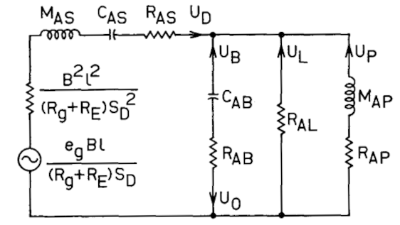
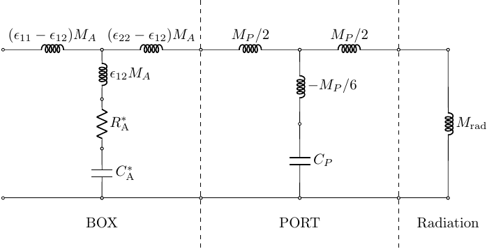
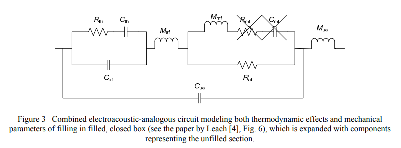

.. _box_theory:
		    
Speakerbench Box Theory
=======================

History of enclosure models
---------------------------
      
The standard theory of loudspeaker enclosures was popularized by Small :cite:`small:1972a,small:1972b,small:1973b`, although the equivalent theory was presented by Benson in greater detail in his series of articles *Theory and Design of Loudspeaker Enclosures* :cite:`benson:1993`

	    Circuit diagram for vented loudspeaker as presented by Small in Ref. :cite:`small:1973b`.

Acoustical impedances for unfilled box
--------------------------------------

In Eq. (7.131) of Beranek :cite:`beranek:2019`, the acoustical impedances for an unfilled enclosure are derived by solving the Helmholtz equation in an unfilled rectangular enclosure. Although Beranek attempts to treat the effect of back-wall lining, we consider infinite (rigid) back-wall impedance. To extract the effective compliance and mass, we expand :math:`Z_{pq}` in powers of :math:`s` to obtain

.. math::
   :label: eq.zpq
	   
   Z_{pq} = \frac{1}{s \cab } + s \ma \, \epsilon_{pq} \; .

In this expression we have ignored terms of order :math:`s^2` and higher. By ignoring these terms we limit the applicability of the theory to the frequency range where the neglected terms are small. Note that in this section, all masses and compliances are assumed to be in acoustic units. When mechanical units are used, a lower-case :math:`m` subscript will be added. The quantity :math:`\epsilon_{pq}` is a dimensionless :math:`2\!\times\!2` array 

.. math::
   :label: eq.eps
	   
   \begin{equation}	   
   \epsilon_{pq} = \frac{1}{3} + \frac{4}{\pi} \sum_{m,n} \gamma_{mn} \frac{\coth(\pi \dmn)}{\dmn} \cos\left(\theta_p\right) \cos\left(\theta_q\right) \frac{J_1\left(\beta_p \right)}{\beta_p}  \frac{J_1\left(\beta_q \right)}{\beta_q} \; ,
   \end{equation}

where in Eq. :eq:`eq.eps` we have defined

.. math::
   :label: eq.defs
	   
   \begin{align}
	   \theta_p = &~ \frac{n \pi y_p}{l_y} \\
	   \beta_p = &~ \frac{\pi a_p}{l_z}\dmn \\
	   \dmn^2 = &~ \left( \frac{m l_z}{l_x} \right)^2 + \left( \frac{n l_z}{l_y} \right)^2 . \\
	   \gamma_{mn} = &~ 4-2 \left( \delta_{m0}+\delta_{n0} \right)
   \end{align}

The index :math:`p=1` corresponds to the driver (subscript :math:`D`) and :math:`p=2` corresponds to the port (subscript :math:`P`). We have chosen simple normalizing acoustic compliance and mass,

.. math::
   :label: eq.units
	   
	   \begin{align}
	   \cab = &~ \frac{\vb}{\rho c^2} = C_\mathrm{MB} \sd^2 \; , \\
	   \ma = &~ \frac{\rho \, l_z}{\sb} \; , 
	   \end{align}

where :math:`\sb = l_x \, l_y` is the baffle area, :math:`l_z` is the enclosure depth, :math:`\sd = \pi \ad^2` is the driver area, and :math:`V= l_x \, l_y \, l_z` is the enclosure volume. The circuit diagram for a low-frequency T-network system for an undamped vented box (box connected to a tube) is illustrated in Fig. fig.genbox.

	    Circuit diagram for low-frequency unfilled box (BOX) connected to
	    transmission-line tube (PORT), which radiates into free air.

Connection to Beranek factor
^^^^^^^^^^^^^^^^^^^^^^^^^^^^

The end-correction factor :math:`B`, first introduced by Beranek in his 1954 book :cite:`beranek:1954`, is related to the piston self-interaction coefficient :math:`\epsilon_{11}` and defines the acoustic mass :math:`M` when the port is blocked:

.. math::
   M_{11} \doteq \epsilon_{11} \ma =  \frac{B \rho}{\pi \, \ad} \; .

Thus, we can define :math:`B` in terms of :math:`\epsilon_{11}` as

.. math::
   B = \pi \epsilon_{11} \frac{l_z \ad}{l_x l_y} \; .

End correction due to box mass
^^^^^^^^^^^^^^^^^^^^^^^^^^^^^^

Because there is no precise theory for the effective port length, :math:`\lp`, in terms of the physical port length, :math:`l_\mathrm{phys}`, it is customary to first define the effective length in terms of the resonant frequency :math:`\wp` as

.. math::
   \wp^2 = \frac{1}{\cab \map} = \frac{\sp c^2}{\vb \lp} \; .

To derive this result we have used

.. math::
   \map = \frac{\mmp}{\sp^2} = \frac{\rho\vp}{\sp^2} = \frac{\rho \,\lp}{\sp} \; .

The interior of the box provides an end correction to the port mass. In the case where the port is *external* to the box (internal flange), the exterior end correction is the usual unflanged value

.. math::
   l_\mathrm{out} = 0.6 \, \ap

whereas the internal correction is

.. math::
  l_\mathrm{in} = \frac{\epsilon_{22}-\epsilon_{21}}{\sb} \sp \, l_z 

Summary of acoustic masses
^^^^^^^^^^^^^^^^^^^^^^^^^^

The identification and calculation of acoustic masses is complicated and depends strongly on geometry. In an effort to clarify the physical interpretation, we tabulate the relevant acoustic masses in :numref:`tab.mass` below.

.. csv-table:: **Box and vent acoustic masses**
   :align: center
   :header: "", *outer*, *intrinsic*,*inner*
   :widths: 25, 25, 25, 25
   :name: tab.mass

   port,":math:`\displaystyle \left(0.6\ap\right)\frac{\rho}{\sp}`",":math:`\displaystyle \frac{\rho \, \vp}{\sp^2}`",":math:`\displaystyle \left(\epsilon_{22}-\epsilon_{12}\right)\,\ma`"
   box,":math:`\displaystyle \left(0.6\ad\right) \frac{\rho}{\sd}`",":math:`\displaystyle \frac{\mms}{\sd^2}`",":math:`\displaystyle \epsilon_{11} \, \ma`"

The **outer** masses result from radiation into free space. For both the driver and port, the coefficient of 0.6 applies to unflanged radiation. Note that for flanged radiation (infinite baffle) the coefficient is 0.85. The **intrinsic** box and port masses are the moving masses of the driver, and port air plug, respectively. For the driver, it is assumed that the outer mass is already contained in the advanced model :math:`\mms` whereas for the port, we assume it is mounted externally to justify the unflanged assumption. The **inner** masses, finally, require numerical evaluation of the Helmholtz matrix elements :math:`\epsilon_{pq}` via Eq. :eq:`eq.eps`.  

Futtrup-Leach model of enclosure fill
-------------------------------------

To incorporate box absorption, we consider the parallel circuit treated by Futtrup :cite:`futtrup:2011` based on the earlier work by Leach :cite:`leach:1989`

	    Reproduction of Fig. 3 from :cite:`futtrup:2011`.

To extract the essential acoustic compliance and resistance of this circuit, we short the masses and take :math:`R_\mathrm{mf} \gg R_\mathrm{af}`. By Taylor-expanding the impedance, we can calculate the series combination of compliance :math:`\cfu` and resistance :math:`\rfu` as

.. math::
   \begin{align}
   \cfu =&~ \caf + \cth + \cua \\
   \rfu =&~ \raf \left(\frac{\caf+\cth}{\cfu}\right)^2 + \rth \left(\frac{\cth}{\cfu} \right)^2
   \end{align}

These results suggest that we can describe the effect of fill with two empirical parameters: :math:`\qa` and :math:`\deltv`. :math:`\qa` is an analog of the box absorption of the classical Benson/Small theory, and :math:`\deltv` is an effective volume expansion coefficient which is normally expected to lie in the range :math:`1.0 < \deltv < 1.4`. The precise definitions are

.. math::
   \begin{align}
   \deltv \doteq &~ \frac{\cfu}{\cab} \; , \\
   \qa \doteq &~ \frac{1}{\ws \cab \rfu} \; .
   \end{align}

Thus we can generalize the classic theory with only a single new added parameter, :math:`\deltv`, which characterizes the volume expansion due the conversion from adiabatic to isothermal expansion. The Futtrup theory provides estimates for :math:`\deltv` and :math:`\qa` for different materials and fill percentages, as illustrated in :numref:`fig.fill1`. Further, in :numref:`fig.fill2`, we compare the predicted relationship of :math:`\qa` versus :math:`\deltv` against experimental measurement in a real filled box.

.. subfigure:: A
   :width: 66%
   :name: fig.fill1
   :align: center
	  
   .. image:: images/box/fill1.png
	    
   Theoretical :math:`\qa` and :math:`\deltv` versus amount of fill inside a test box.
	    

.. subfigure:: A
   :width: 66%
   :name: fig.fill2
   :align: center
	  
   .. image:: images/box/fill2.png

   Theoretical :math:`\qa` versus :math:`\deltv` compared with measured data.

Porous media model of fill
--------------------------

We begin by rewriting Eq. :eq:`eq.zpq` in terms of a generalized density and sound speed 

.. math::
   :label: eq.zpq2
	   
   Z_{pq} = \rho c \left[ \frac{1}{l_x l_y (i k l_z)} + \frac{(i k l_z)}{l_x l_y} \epsilon_{pq} \right] \; .

Use the porous media theory described by Wilson :cite:`wilson:1993`, Tarnow :cite:`tarnow:2002` and others, we first write the generalized density and compressibility as

.. math::
   \begin{align}
   \rho = &~\rho_0 \left[ \frac{\sqrt{1+s\tauv}}{\sqrt{1+s\tauv}-1} \right] \; , \\
   \beta = &~ \frac{1}{\gamma P_0} \left[ 1 + \frac{\gamma-1}{\sqrt{1+s\taue}} \right] \; ,
   \end{align}

where :math:`\taue` is the decay time of the *entropy mode* and :math:`\tauv` is the decay time of the *vorticity mode*. :math:`c = 1/\sqrt{\beta\rho}` and :math:`k = \omega \sqrt{\beta\rho}`. Taking the limit :math:`\taue, \tauv \rightarrow \infty` gives the result for an unfilled enclosure. Substituting these expressions into Eq. :eq:`eq.zpq2` gives

.. math::
   Z_{pq} = \frac{1}{s \cab \displaystyle \left[ 1 + \frac{\gamma-1}{\sqrt{1+s\taue}} \right]} + s \ma \epsilon_{pq} \left[ \frac{\sqrt{1+s\tauv}}{\sqrt{1+s\tauv}-1} \right] \; .

Testing shows that this form of the impedance gives unphysical results. Instead, a modified form that preserves the undamped mass loading on the port performs much better:

.. math::
   Z_{pq} = \frac{1}{s \cab \displaystyle \left[ 1 + \frac{\gamma-1}{\sqrt{1+s\taue}} \right]} + \frac{s \ma \epsilon_{11}}{\sqrt{1+s\tauv}-1} + s \ma \epsilon_{pq} \; .

Note that :math:`Z_{11}` is unmodified, whereas the port loading :math:`Z_{22}-Z_{21}` recovers the unfilled value. 
