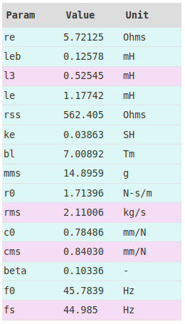

.. _box_theory:

=======================
Speakerbench Box Theory
=======================

Below we review selected elements of the driver/enclosure theory used in Speakerbench. We highlight those features that are not well-covered in the literature. At the end of this page we give a brief summary of the model options available in the Speakerbench app.

History of enclosure models
---------------------------

The standard theory of loudspeaker enclosures was popularized by Small :cite:`small:1972a,small:1972b,small:1973b`, although the equivalent theory was presented by Benson in greater detail in his series of articles *Theory and Design of Loudspeaker Enclosures* :cite:`benson:1993`.

.. subfigure:: AB
   :name: fig.bensonsmall
   :width: 90%
   :gap: 80px
   :align: center
   :subcaptions: below

   .. image:: images/box/small_vented.png
      :alt: Acoustical circuit (Small)
   .. image:: images/box/benson_vented.png
      :alt: Mechanical circuit (Benson)

   Acoustical circuit for vented loudspeaker as presented by Small in Ref. :cite:`small:1973b` (left) compared with equivalent mechanical circuit by Benson :cite:`benson:1993` (right).

DRIVER: the advanced model
--------------------------

The *blocked electrical* and *motional* impedances of the driver are modified from the standard Thiele-Small expressions according to

.. math::
   :label: eq.oldnew
	
   \begin{align*}	
   \ze & = & \re + s L_3 & \longrightarrow & \re + s \leb + \left( \frac{1}{\rss} + \frac{1}{s \le}
   + \frac{1}{\sqrt{s} \ke} \right)^{-1} \; , \\
   \mathbb{Z}_{\rm mot} &=& s \mms + \rms + \frac{1}{s\cms} & \longrightarrow &
   s \mms + R_0 + \displaystyle \frac{1}{s C_0 \left[ 1+\beta\ln(1+\omega_0/s)\right]} \; .
   \end{align*}

The equivalent electrical circuit for the driver in free air is given in :numref:`fig.elec_total`. For a given advanced model representation, Speakerbench also generates a best-approximation Thiele-Small model. A concrete example of the conversion for the SEAS L16RNX is given below:

   Speakerbench parameter results for the SEAS L16RNX. Advanced parameters are shown in blue. Reduced TS model, derived from the advanced fit, are shown in pink.

BOX: T-network (Beranek) enclosure model
----------------------------------------

Speakerbench allows simulations of **classic** and **Beranek** boxes. The classic box is well-treated in the literature and provides a well-established reference point for modeling. The classic model is nevertheless approximate and this has motivated us to also provide the Beranek model which more carefully treats the acoustic masses. We choose to call the model Beranek because all the theory was well-known to him.

The classic form for the acoustic impedance of an enclosure is

.. math::
   Z_\mathrm{box} =  \frac{1}{s \cab} + \rab

where :math:`\cab` is the acoustic compliance and :math:`\rab` is the box absorption. There is no model for the classical absorption and so it is purely an empirical parameter.

A vented enclosure is represented not by a single circuit element but rather by a 2-port network. In Eq. (7.131) of Beranek :cite:`beranek:2019`, the acoustical network impedances for an unfilled enclosure are derived by solving the interior Helmholtz equation. Although Beranek attempts to treat the effect of back-wall lining, we consider infinite (rigid) back-wall impedance. To extract the effective compliance and mass, we expand :math:`Z_{pq}` in powers of :math:`s` to obtain the network impedances

.. math::
   :label: eq.zpq
	
   Z_{pq} = \frac{1}{s \cab } + s \mab \, \epsilon_{pq} \; .

In this expression we have ignored terms of order :math:`s^2` and higher. By ignoring these terms we limit the applicability of the theory to the frequency range where the neglected terms are small. We have also ignored the box absorption :math:`\rab` but this empirical effect can be added if desired. Note that, in this section, all masses and compliances are assumed to be in acoustic units. When mechanical units are used, a lower-case :math:`m` subscript will be added. The quantity :math:`\epsilon_{pq}` is a dimensionless :math:`2\!\times\!2` array

.. math::
   :label: eq.eps
	
   \begin{equation}	
   \epsilon_{pq} = \frac{1}{3} + \frac{4}{\pi} \sum_{m,n} \gamma_{mn} \frac{\coth(\pi \dmn)}{\dmn} \cos\left(\theta_p\right) \cos\left(\theta_q\right) \frac{J_1\left(\beta_p \right)}{\beta_p}  \frac{J_1\left(\beta_q \right)}{\beta_q} \; ,
   \end{equation}

where in Eq. :eq:`eq.eps` we have defined

.. math::
   :label: eq.defs
	
   \theta_p      & = \frac{n \pi y_p}{L_y} \; , \\
   \beta_p       & = \frac{\pi a_p}{L_z}\dmn \; , \\
   \dmn          & = \sqrt{\left( \frac{m L_z}{L_x} \right)^2 + \left( \frac{n L_z}{L_y} \right)^2} \; , \\
   \gamma_{mn}   & = 4-2 \left( \delta_{m0}+\delta_{n0} \right) \; .

The indices :math:`p=(1,2)` correspond to the driver and port

.. math::
   \begin{array}{cll}
   p = 1 & \ap = \text{Port radius}   & \yp = \text{Port height} \\
   p = 2 & \ad = \text{Driver radius} & \yd = \text{Driver height}
   \end{array}

We have chosen simple normalizing acoustic compliance and mass,

.. math::
   :label: eq.units
	
   \cab & = \frac{\vb}{\rho c^2} = C_\mathrm{MB} \sd^2 \; , \\
   \mab & = \frac{\rho \, L_z}{\sb} \; ,

where :math:`\sb = L_x \, L_y` is the baffle area of the enclosure (inside the box), :math:`L_z` is the enclosure depth, :math:`\sd = \pi \ad^2` is the driver area, and :math:`\vb = L_x \, L_y \, L_z` is the enclosure volume. The 2-port circuit diagram for a vented box at low frequency is illustrated in :numref:`fig.box`.

.. subfigure:: AB
   :name: fig.box
   :width: 90%
   :gap: 80px
   :align: center
   :subcaptions: below

   .. image:: images/box/box_classic.png
   .. image:: images/box/box_q.png

   Comparison of T-network circuit for classic (left) model versus T-network circuit for Beranek (right) model.

In the model shown in :numref:`fig.box`, we have retained the empirical box absorption which can be equivalently written as an absorption :math:`Q`

.. math::
   \qa \triangleq \frac{1}{\ws \cab \rab} \; .

The compliance :math:`\cfu` is a modified compliance that accounts for volume expansion due to the conversion from adiabatic to isothermal expansion. This effect is described by Futtrup :cite:`futtrup:2011` and also in the earlier work by Leach :cite:`leach:1989`. A more rigorous treatment of wave propagation in porous media outside the context of loudspeaker enclosures is given by Wilson :cite:`wilson:1993`, Tarnow :cite:`tarnow:2002` and others. We write the modified compliance as

.. math::
   \cfu \triangleq \deltv \, \cab \quad \text{where} \quad \cab = \frac{\vb}{\gamma P_0} \; .

The empirical parameter :math:`\deltv` is allowed to vary in the range :math:`1.0 < \deltv < 1.4` in order to mimic the variation of :math:`\gamma` in the range :math:`1.4 > \gamma > 1.0`. At this time, there is no general theory which can connect material properties of fill to precise values of :math:`\rab` and :math:`\deltv`. Evidently, :math:`\deltv=1` corresponds to adiabatic compression with :math:`\gamma=C_P/C_V=1.4`, whereas for an enclosure densely filled with fiberglass, :math:`\deltv \to 1.4` as :math:`\gamma \to 1` in the isothermal limit.

Connection to Beranek factor
............................

The radiation mass factor :math:`B`, first introduced by Beranek in his 1954 book :cite:`beranek:1954`, is related to the piston self-interaction coefficient :math:`\epsilon_{11}` and defines the acoustic mass :math:`M` when the port is blocked:

.. math::
   M_{11} \triangleq \epsilon_{11} \mab =  \frac{B \rho}{\pi \, \ad} \; .

Thus, we can define :math:`B` in terms of :math:`\epsilon_{11}` as

.. math::
   :label: eq.bfactor
	
   B = \pi \epsilon_{11} \frac{L_z \, \ad}{L_x \, L_y} \; .

The mass loading factor was discussed at length by Leach :cite:`leach:1989`, who was unaware of its theoretical basis. Note that Eq. :eq:`eq.bfactor` generalizes the result in :cite:`beranek:2019` to arbitrary frontal cross-section and driver height.

PORT: T-network port model
--------------------------

The classic form for the acoustic impedance of the port is

.. math::
   Z_\mathrm{port} =  \rap + s \map \; .

This model for the port also contains an empirical loss factor :math:`\rap` that cannot be computed from first-principles but can only be empirically determined. This form is also valid only for wavelengths much longer than the port length.

.. subfigure:: AB
   :name: fig.port
   :width: 90%
   :gap: 80px
   :align: center
   :subcaptions: below

   .. image:: images/box/port_classic.png
   .. image:: images/box/port_q.png
	
   T-network diagrams for classic (left) and T-line (right) ports. Here, :math:`\zeta` is a complex propagation constant defined in :eq:`eq.zeta`, :math:`Z = \rho c/\sp` is the specific acoustic impedance of air in the vent, :math:`M_\mathrm{API}` is the inner port radiation mass, and :math:`M_\mathrm{APO}` is the outer port radiation mass.

The complex propagation constant used in Speakerbench is

.. math::
   :label: eq.zeta
	
   \zeta = \left( s+\frac{\wb}{\qps} \right) \frac{\lpp}{c} \; .

We use a star to denote a modified form of :math:`\qp` used as the Speakerbench input for both classic and transmission line ports. This modified definition is done for convenience and is related to the traditional definition according to

.. math::
   :label: eq.qp
	
   \qps \triangleq \frac{\lpp}{\lp} \frac{1}{\wb\cab\rap} = \frac{\lpp}{\lp} \qp \; ,

where :math:`\lpp` is the physical port length, and :math:`\lp` is the effective port length.

End corrections
...............

Because there is no precise theory for the effective port length, :math:`\lp`, in terms of the physical port length, :math:`\lpp`, it is customary to first define the effective length in terms of the resonant frequency :math:`\wpb` as

.. math::
   \wpb^2 = \frac{1}{\cab \map} = \frac{\sp \, c^2}{\vb \lp} \; .

To derive this result we have used

.. math::
   \map = \frac{\mmp}{\sp^2} = \frac{\rho\vp}{\sp^2} = \frac{\rho \,\lp}{\sp} \; .

Radiation from both ends of the port (one end in the box, one end outside the box) will provide end corrections to the effective port mass, thereby lowering the port resonant frequency. The inner and outer radiation masses, :math:`\rho \, \lpi/\sp` and :math:`\rho \, \lpo/\sp`, will determine the end corrections as detailed in the next section. In the Beranek model of the enclosure, the volume velocity through the radiation mass represents the sound exiting the vent, whereas the velocity through the :math:`\mathrm{csch}` branch is associated with reflections and compression in the tube. In this case the internal correction is

.. math::
  \lpi = \frac{\epsilon_{22}-\epsilon_{12}}{\sb} \sp \, L_z \; .

Generally, the effective length of the port is given by

.. math::
   \lp = \lpi + \lpp + \lpo

Summary of radiation masses
---------------------------

The identification and calculation of various radiation masses is complicated and potentially confusing for Speakerbench users. In an effort to clarify the physical interpretation, we tabulate the relevant moving masses and end corrections as implemented in Speakerbench. The treatment of radiation mass is different in the **classic** and **Beranek** models. First, in :numref:`tab.endc`, we summarize the well-known dimensionless radiation impedance factors for ducts and pistons

.. csv-table:: **Dimensionless radiation impedance factors**
   :align: center
   :header: *factor*, *value*, *explanation*
   :widths: 20, 20, 50
   :name: tab.endc

   :math:`\lpu`,:math:`0.6133`,unflanged duct :cite:`levine:1948`
   :math:`\lpf`,:math:`0.8216`,infinitely flanged duct :cite:`levine:1948`
   :math:`\ldfree`,:math:`\displaystyle \frac{4}{3\pi} \simeq 0.4244`,piston in free air (one side) :cite:`morse:1968`
   :math:`\ldu`,:math:`\displaystyle \frac{2}{\pi} \simeq 0.6366`,closed-back piston :cite:`morse:1968`
   :math:`\ldf`,:math:`\displaystyle \frac{8}{3\pi} \simeq 0.8488`,infinitely baffled piston (one side)

In terms of these factors, Speakerbench decomposes the driver masses as shown in :numref:`tab.massd`, and the vent end corrections as shown in :numref:`tab.lp`.

.. csv-table:: **Driver physical and radiation masses**
   :align: center
   :header: *model*, :math:`\mmf` (front), :math:`\mmd` (physical) , :math:`\mmr` (rear), :math:`\mmse` (effective)
   :widths: 20, 20, 20, 20, 20
   :name: tab.massd

   classic,":math:`\displaystyle \ldfree \mmz`",":math:`\displaystyle \mms-2\ldfree \mmz`",":math:`\displaystyle \ldfree \mmz`",":math:`\displaystyle \mms`"
   Beranek,":math:`\displaystyle 0.9 \ldf \mmz`",":math:`\displaystyle \mms-2\ldfree \mmz`",":math:`\displaystyle \epsilon_{11} \mab \sd^2`",":math:`\displaystyle \sum`"

.. csv-table:: **Vent intrinsic and radiation lengths**
   :align: center
   :header: *model*, :math:`\lpo` (outer), :math:`\lpp` (physical) , :math:`\lpi` (inner), :math:`\lp` (effective)
   :widths: 20, 20, 20, 20, 20
   :name: tab.lp

   classic,":math:`\displaystyle \lpf\,\ap`",":math:`\displaystyle \frac{\vp}{\sp}`",":math:`\displaystyle \lpu\,\ap`",":math:`\displaystyle \sum`"
   Beranek,":math:`\displaystyle \lpu\,\ap`",":math:`\displaystyle \frac{\vp}{\sp}`",":math:`\displaystyle (\epsilon_{22}-\epsilon_{12}) L_z \frac{\sp}{\sb}`",":math:`\displaystyle \sum`"

In :numref:`tab.massd`, :math:`\mms` is the moving mass of the driver as measured in free-space by a measurement system. This differs from :math:`\mmse`, which is the moving mass of the driver when mounted in a box. Also, the radiation masses above are defined in terms of :math:`\mmz = \rho \pi \ad^3`. These tables should be compared with the numerical values provided by Speakerbench in the Info tab of the box app.

The **outer** masses arise from radiation into free space, whereas the **inner** masses arise from radiation into the enclosure. The inner masses are sensitive to the enclosure geometry. In the **classic model**, the port is *internal*, and the flanged and unflanged coefficients are used for the outer and inner masses, respectively. The inner and outer radiation coefficients are each assumed to be one-half of the infinitely-baffled values, which is smaller than would be expected physically.

In the **Beranek model** the port is *external* and the unflanged coefficient is used for the outer mass, whereas the inner mass is proportional to :math:`\epsilon_{22}-\epsilon_{12}`. The outer driver radiation is partially-baffled (taken as 90\% of the inifinite baffle impedance, which is closer to reality) whereas the inner is proportional to :math:`\epsilon_{11}`. Generally, the partial-baffle coefficient must lie between 0.75 (zero baffle) and 1.0 (infinite baffle) as discussed by Beranek (see, for example, the *Simple Enclosures* section of :cite:`beranek:1954`). The exact value requires the solution of the exterior Helmholtz equation. For the **inner** masses in the Beranek model, we numerically evaluate the Helmholtz matrix elements :math:`\epsilon_{pq}` via Eq. :eq:`eq.eps`.
