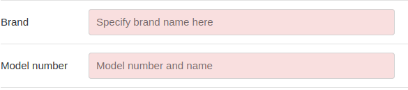
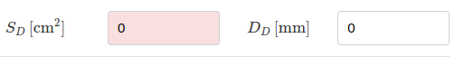

.. meta::
   :author: Jeff Candy and Claus Futtrup
   :keywords: speakerbench,loudspeaker,driver,parameter,json,design,calculator,impedance,measurement,simulation,software,free,audio
   :description: Speakerbench Documentation

================
Create datasheet
================

.. note::
   **STEP 3**: In this section you'll create a complete datasheet (SBD-file) for your driver, suitable for importing in the box model app.

The **Import** tab ('page') in the Datasheet Creator application is a simple way to load one of a few predefined drivers into the creator. The import tab is not needed when working with your own measurements.

The datasheet creator takes input from the fitter. The purpose of the creator is to add information to your dataset such that it becomes enough information to constitute a *complete datasheet* for the driver (but without frequency response graphs or other pictures). This complete dataset may be filed on your computer locally and/or shared with others. To be able to save the data, you must add the **Brand** and **Model number**.

|

as well as the effective piston **driver area** (or diameter)

|

It is customary to add the driver excursion, :math:`\xmax`, which is available under the Simple tab, but it is not required by Speakerbench. Once these additional parameters are added, the data object will be sufficient for box modeling. Beyond the necessary input data, you can provide additional information for the datasheet which may be useful in extreme environments; for example, air parameters (air temperature, barometric pressure, relative humidity) which are used for calculating :math:`\vas`.

.. note::
   When you hover your mouse over a parameter, a tooltip appears and provides a brief explanation.
