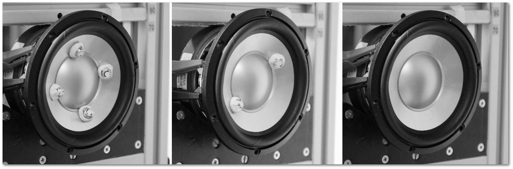

.. _deltamass_theory:

Dual-Added-Mass Method
======================

The Standard Added-Mass Method
------------------------------

A traditional, straightforward technique to estimate loudspeaker parameters is the well-known *added-mass* approach. By adding a known mass to the cone, and comparing the impedance to the unweighted impedance, sufficient information is obtained to determine the electromechanical parameters. In recent decades, alternative approaches utilizing a laser have been applied: either Doppler-laser which identifies the velocity :cite:`moreno:1991`, or a triangulation laser which identifies the position of the loudspeaker cone :cite:`seidel:2001`. The added-mass approach is still used when a laser is not available, e.g. for hobbyist speaker builders. In this paper we propose an approach, which uses two known added masses, and exclusively electrical impedance measurements, to extract the motional impedance. This new approach has the potential to identify the motor strength, :math:`\bl`, and moving mass, :math:`\mms`, with higher accuracy than the classical added-mass method. Furthermore, the motional impedance can be analytically isolated, making the new method well-suited for curve fitting to a lumped parameter model for identification of viscoelastic properties. If sufficient care is taken, the method can offer many of the accuracy benefits of a laser without the cost. One caveat however is that, like the traditional added-mass approach, the dual-added-mass method is **not** suitable for measuring tweeters (in particular soft-dome tweeters) or microspeakers

The new technique we present was motivated by the emergence of modern lumped parameters models that provide some description of the viscoelastic properties of the loudspeaker suspension. Looking back on the history of moving-coil transducers, we see that Olson had already described the traditional model of the mechanical side of a loudspeaker in terms of mass, resistance, and compliance in his 1940 text *Elements of Acoustical Engineering* :cite:`olson:1940`. Decades later, in 1978, Brian Elliott presented an AES paper expressing a realization that the loudspeaker suspension is made from elastomers and shows signs of viscoelastic hysteresis :cite:`elliott:1978`.  In this work Elliott appears to coin the expression *frequency-dependent damping*.  The observation of frequency-dependent damping in the audio frequency range is directly related to the presence of viscoelasticity.  Another 15 years later, in 1993, Knudsen and Jensen presented their development of the LOG-model :cite:`knudsen:1993` which quantified the viscoelastic *creep effect*.  A variation of the LOG model was adopted by Wolfgang Klippel (around 2001) and has since been a kind of de facto industry standard.  In recent years a number of newer models have appeared. Although a discussion and comparison of these newer models is not given in these notes, we remark that they provided the motivation for the present analysis.

A Dual-Added-Mass Technique
---------------------------

Model-free extraction of motional impedance
^^^^^^^^^^^^^^^^^^^^^^^^^^^^^^^^^^^^^^^^^^^

The measurement of total (electrical) impedance of an electro-dynamic transducer consists of the *blocked electrical* plus *mechano-acoustic* contributions

.. math::
   :label: eq.z

   Z(\omega) = \ze + \zm = \ze + \frac{1}{i \omega \cmes + \fr(\omega)} \; .

In this expression, :math:`\omega = 2 \pi f` is the *angular frequency* of oscillation and :math:`f` is the frequency in Hz. In the classical Thiele/Small approach, :math:`\fr(\omega)` contains the stiffness :math:`\lces \doteq \cms \bls` and damping :math:`\res \doteq \bls / \rms`, but in a general formulation this part may also include viscoelasticity.  As such :math:`\fr(\omega)` is a model-independent representation of the stiffness and damping.  The only condition which must be met in this formulation is that the moving mass :math:`\mms`, here represented by the electrical equivalent :math:`\cmes \doteq \mms / \bls`, is fully captured by :math:`\cmes` and does not contribute to :math:`\fr`.  This implies that radiation impedance (air load) is assumed to be constant in the frequency range of interest.  Note also that the expression :math:`\zm`, which is often used to denote the mechanical impedance (see for example Ref. :cite:`benson:1993`), refers in this work to the *motional impedance*, or the equivalent electrical impedance of the voice coil due to its motion in the magnetic field.

In the dual-added-mass approach, three measurements of driver impedance are conducted:

1. :math:`Z^{(0)}` Cone unweighted
2. :math:`Z^{(1)}` Cone with added mass :math:`m_1` attached
3. :math:`Z^{(2)}` Cone with added mass :math:`m_2` attached

The three measurements are then decomposed according to

.. math::
   \begin{eqnarray}
   Z^{(0)} &=& \zm^{(0)} + \ze \; , \\
   Z^{(1)} &=& \zm^{(1)} + \ze \; , \\
   Z^{(2)} &=& \zm^{(2)} + \ze \; ,
   \end{eqnarray}

where :math:`\ze` is invariant, and

.. math::
   :label: eq.ck
	
   \zm^{(k)} = \frac{1}{i \omega C_k + \fr(\omega)} \; .

We emphasize that :math:`\ze(\omega)` is taken to have an \textit{arbitrary} frequency dependence in the present analysis (which could include inductance, semi-inductance, or other complex :math:`\omega` dependence.  By combining all three measurements, we can eliminate :math:`\ze(\omega)` from the problem.  Next, instead of three independent :math:`C_k`-values, we take advantage of the fact that we are adding known masses:

.. math::
   \begin{eqnarray}
   C_0 &=& C \; , \\
   C_1 &=& C + \Delta C_1 \; , \\
   C_2 &=& C + \Delta C_2 \; .
   \end{eqnarray}

In terms of added masses, these are:

.. math::
   :label: eq.deltac
	
   \Delta C_1 = \frac{m_1}{\bls} \quad \text{and} \quad \Delta C_2 = \frac{m_2}{\bls}

With this in mind, it is possible to extract the pure motional impedance.  First the electrical impedance, :math:`\ze`, which is unchanged during the added-mass operations, is removed from the data by calculating the following differences

.. math::
   \begin{align}
   \Delta Z_1 \doteq & Z^{(0)} - Z^{(1)} = \zm^{(0)} - \zm^{(1)} = \frac{i\omega\Delta C_1}{(i\omega C+\fr)(i\omega C_1+\fr)} \; ,\\
   \Delta Z_2 \doteq & Z^{(0)} - Z^{(2)} = \zm^{(0)} - \zm^{(2)} = \frac{i\omega\Delta C_2}{(i\omega C+\fr)(i\omega C_2+\fr)} \; .
   \end{align}

In principle, each :math:`\Delta Z` contains no component of electrical impedance, :math:`\ze`, because it is unchanged between measurements.  Therefore each :math:`\Delta Z` contains contributions only from motional impedance.  These formulae depend only on measurement data and are independent of fitting to a given compliance model.  In terms of the unweighted motional impedance :math:`\zm^{(0)}` (which we write as :math:`\zm` for brevity) we have

.. math::
   \begin{eqnarray}
   \Delta Z_1 &=& \displaystyle \frac{i \omega \Delta C_1 \zm^2}{1 + i \omega \Delta C_1 \zm} \; , \\
   \Delta Z_2 &=& \displaystyle \frac{i \omega \Delta C_2 \zm^2}{1 + i \omega \Delta C_2 \zm} \; .
   \end{eqnarray}

These can be solved for :math:`\Delta C_1` and :math:`\Delta C_2`, respectively, to yield:

.. math::
   :label: eq.omegadeltac

   \begin{eqnarray}
   i \omega \Delta C_1 &=& \frac{\Delta Z_1}{\zm^2 - \zm \Delta Z_1} \; , \\
   i \omega \Delta C_2 &=& \frac{\Delta Z_2}{\zm^2 - \zm \Delta Z_2} \; .
   \end{eqnarray}

For the dual-added-mass method to be valid, :math:`\Delta C_1` and :math:`\Delta C_2` as defined in Eq. :eq:`eq.deltac` must be independent of frequency. If this condition is satisfied, we can derive an expression for the model-free motional impedance:

.. math::
   \frac{\Delta C_2}{\Delta C_1} = \frac{\Delta Z_2}{\Delta Z_1} \frac{\zm - \Delta Z_1}{\zm - \Delta Z_2} = \mu \; ,

where :math:`\mu = m_2 / m_1`. Thus, we arrive at the key result; namely, the *model-free motional impedance*:

.. math::
   :label: eq.zms

   \zms = \frac{(1-\mu) \Delta Z_1 \Delta Z_2}{\Delta Z_2 - \mu \Delta Z_1} \; .

For clarity, we refer to this *estimate* of the motional impedance as :math:`\zms`. Although :math:`\zms` is formally a good approximation to the true :math:`\zm` as long as :math:`\Delta C_1` is independent of :math:`\omega`, in practice the accuracy of :math:`\zms` is limited to the region where :math:`\Delta Z_1` and :math:`\Delta Z_2` are not too small.  A sample calculation is given in :numref:`fig.zms` and shows that, in reality, :math:`\zms` is accurate and should be used only in the vicinity of :math:`\omega = \ws`, where :math:`\ws` is the driver resonant frequency.  Despite this caveat, there are two advantages to the dual-added-mass approach.  First, it operates entirely on measurement data without any model assumptions about stiffness or damping.  Second, the mechanical impedance is completely isolated, with :math:`\ze` removed from the problem.  In addition to :math:`\ze`, the amplifier's output impedance (i.e., the generator impedance :math:`R_g`), the cable impedance, and the series (current sensor) resistor of the measurement equipment are removed from the problem.  In contrast, when attempting to determine the motional parameters using the traditional delta-mass or delta-volume methods, it is not possible to eliminate :math:`\ze` from the problem. For this reason an approximate lumped-parameter model for :math:`\ze` must be assumed :cite:`struck:2010, thorborg:2013`, such that errors associated with :math:`\ze` become intertwined with errors in :math:`\zm`.  The present method removes this source of error.

Using the model-free motional impedance, we can estimate the resonant frequency of the mechanical system as

.. math::
   :label: eq.fs_estimated

   \ws = \mathrm{argmax}_\omega \left( \left|\zms\right| \right ) = 2 \pi \fs \; .

A strict definition of the resonant frequency based purely on data is not necessary insofar as it will be derivable from motional fit parameters to be determined in the in what follows.  We remark that the resonant frequency as defined in Eq. :eq:`eq.fs_estimated` does not exactly coincide with the location of :math:`\mathrm{Im}\,\zms = 0` due to the frequency-dependence of the effective damping (i.e., the real part of :math:`\fr`).  Thus there is potential ambiguity with respect to the definition of :math:`\ws` in viscoelastic systems. To provide a noticeable shift in the resonant frequency and thereby detect the viscoelastic properties with optimal accuracy, we generally recommend that :math:`m_2` is close to the transducer's moving mass, and that :math:`m_1` is approximately half the moving mass.  These choices will produce shifts of about 40\% and 20\%, respectively, in the resonant frequency :math:`\ws`.

Estimation of :math:`\bl`
^^^^^^^^^^^^^^^^^^^^^^^^^

Based on Eqs. :eq:`eq.deltac` and :eq:`eq.omegadeltac`, :math:`\bl` is calculated as

.. math::
   :label: eq.blw

   \bls = \frac{m_1}{\Delta C_1} = m_1 \, \mathrm{Re} \left\langle \frac{i \omega \zms ( \zms - \Delta Z_1)}{\Delta Z_1} \right\rangle_{\omega_1}^{\omega_2} \; ,

where the angle brackets denote an average.  For each measurement point in frequency, a :math:`\bl` value can be extracted and hence it is possible to plot a :math:`\bl(\omega)` curve.  An example of this curve is shown in Fig. :numref:`fig.bl`.  Of course, :math:`\bl` in the model does not change with frequency, so it remains to select a suitable frequency range for the average in Eq. :eq:`eq.blw`.  We recommend :math:`\omega_1 = 0.8 \omega_s` and :math:`\omega_2 = 1.2 \omega_s`, where :math:`\ws` is determined by Eq. :eq:`eq.fs_estimated`.  For the average to be meaningful, a flat area of the :math:`\bl(\omega)` curve must be found. Typically, provided the measurements are good, this occurs in the vicinity of the free-air resonant frequency of the driver.  In this way, :math:`\bl` may be determined *without* any model assumptions about :math:`\fr(\omega)`.

Accurate determination of :math:`\bl` is crucial in order to ensure we can reliably transform parameters from the mechanical to the electrical domain.

Estimation of :math:`\mms`
^^^^^^^^^^^^^^^^^^^^^^^^^^

We will now describe a method to deduce the moving mass :math:`\mms`, along with other motional fit parameters, from motional data :math:`(\zms)_j`.  For this we need to choose a specific lumped-parameter model. In what follows, all fitting results will be based on the LOG compliance model :cite:`knudsen:1993` for the motional impedance

.. math::
   :label: eq.glog

   g(\omega) \doteq \frac{1}{\rlog} + \frac{\ql(\omega)}{i \omega \llog}\; ,

where :math:`\ql` is a complex factor that describes viscoelastic creep and frequency-dependent damping

.. math::
   :label: eq.blog

   \ql = \frac{1}{1-\beta \ln(i\omega)} \; .

Note that the traditional Thiele-Small form is obtained by setting :math:`\beta = 0` so that :math:`\ql = 1`. The LOG model has recently been used by Hiebel to describe creep in miniature loudspeakers :cite:`hiebel:2012`.  The Klippel system also adopts a form of the LOG model, but approximates :math:`\ln(i\omega)` with :math:`\ln(\omega)` :cite:`seidel:2001`, thereby neglecting the frequency-dependent damping effect. If, for a moment, we consider that the value of :math:`\beta` is known, then we can write a linear equation for the motional parameters,

.. math:: \frac{1}{\zms} = i \omega \, a + b + \frac{i \ql(\omega)}{\omega} \, c \; ,

where for brevity we have defined :math:`a=\cmes`, :math:`$b=1/\rlog` and :math:`c=-1/\llog`.  This simple form implies that we can obtain a coefficient solution by linear least squares.  To do this, we define the error functional (the squared norm of the residual)

.. math::
   :label: eq.errorm

   \varepsilon_\beta(a,b,c) \doteq \sum_j \left[ \left( b - \frac{\ql_I(\omega)}{\omega_j} \, c - \mathrm{Re}\,Y_j \right)^2 + \left( \omega_j a + \frac{\ql_R(\omega_j)}{\omega_j} \, c - \mathrm{Im}\, Y_j \right)^2 \right] \; ,

where

.. math:: Y_j \doteq \frac{1}{(\zms)_j}

is the motional admittance.  Here, :math:`\ql_R = \mathrm{Re}\,\ql` and :math:`\ql_I = \mathrm{Im} \,\ql`. The summation variable :math:`j` denotes a suitable subdomain of the frequency range. For the analysis in the present paper, we choose values of :math:`j` for which :math:`0.8 \ws < \omega_j < 1.2 \ws`. Taking the partial derivatives of :math:`\varepsilon` with respect to :math:`a,b,c` yields the following linear equations for the minimum norm of the residual:

.. math::
   :label: eq.lsq

   \left[
   \begin{array}{>{\displaystyle}c >{\quad\displaystyle}c >{\quad\displaystyle}c}
   \displaystyle \sum_j \omega_j^2      &     0    & \displaystyle \sum_j \ql_R(\omega_j) \\
   0                     & \displaystyle \sum_j 1 &  \displaystyle -\sum_j \frac{\ql_I(\omega_j)}{\omega_j} \\
   \displaystyle \sum_j \ql_R(\omega_j) & \displaystyle -\sum_j \frac{\ql_I(\omega_j)}{\omega_j} &
   \displaystyle \sum_j \frac{\ql_R^2+\ql_I^2}{\omega_j^2}
   \end{array}
   \right]
   \left[ \begin{array}{*1{>{\displaystyle}c}}
   \displaystyle a_0 \\
   \displaystyle b_0 \\
   \displaystyle c_0 \end{array}
   \right] =
   \left[ \begin{array}{*1{>{\displaystyle}c}}
   \displaystyle \sum_j \omega_j \, \mathrm{Im}\, Y_j \\
   \displaystyle \sum_j \mathrm{Re} \, Y_j \\
   \displaystyle \sum_j \frac{\ql_R \, \mathrm{Im}\, Y_j - \ql_I \, \mathrm{Re}\, Y_j}{\omega_j}
   \end{array}
   \right]

More precisely, :math:`\varepsilon_\beta \left[ a_0(\beta),b_0(\beta),c_0(\beta) \right]` represents the minimum residual at fixed :math:`\beta`. A further 1-dimensional minimization of :math:`\varepsilon_\beta` over :math:`\beta` is required to find the true minimum.  Let us denote the result of this final minimization as :math:`\beta_0`, which can be obtained using any standard 1D minimization scheme. Then, the moving mass is given by :math:`\mms = \bls a_0(\beta_0)`.  This fitting process also determines the effective resistance :math:`\rlog` and compliance :math:`\llog`, as well as the creep parameter :math:`\beta`.

To be clear, we repeat that for a given :math:`\beta`, the inputs to Eq. :eq:`eq.lsq` are :math:`Y_j` and the frequencies :math:`\omega_j`, whereas the outputs are :math:`\cmes`, :math:`\rlog` and :math:`\llog`.  We use :math:`\beta` for viscoelasticity expressed using a natural logarithm, but this may be easily converted to classical :math:`\lambda` values utilizing the base-10 LOG representation.

Equivalent :math:`\res` and :math:`\lces`
^^^^^^^^^^^^^^^^^^^^^^^^^^^^^^^^^^^^^^^^^

It is of some interest to determine equivalent values for :math:`\res` and :math:`\lces` in the LOG model that can be compared with traditional Thiele-Small parameters. Although the correspondence is not unique, a simple method approach is to set

.. math:: g(\ws) \doteq \frac{1}{\res} + \frac{1}{i\ws \lces} \; .

Then, some algebra shows that

.. math::
   \begin{eqnarray}
   \frac{1}{\lces} &=& \frac{1}{\llog} \frac{1-\beta\ln(\ws)}{(1-\beta\ln\ws)^2+(\pi\beta/2)^2} \; , \\
   \frac{1}{\res} &=& \frac{1}{\rlog} + \frac{1}{\ws\llog} \frac{\pi\beta/2}{(1-\beta\ln\ws)^2+(\pi\beta/2)^2} \; .
   \end{eqnarray}

Mass-consistency check
^^^^^^^^^^^^^^^^^^^^^^

We propose a type of consistency check that can provide a critical assessment of the data quality. First, using the model-free impedance :math:`\zms`, we can check for mass consistency using

.. math:: m_1^* = \mathrm{Re} \left[ \frac{\bls}{i \omega} \frac{\Delta Z_1}{\zms(\zms-\Delta Z_1)} \right] \; .

The right-hand side will be independent of :math:`\omega` if Eq. :eq:`eq.z` is valid.  Also, since we have fitted :math:`\zm` to a specific model to determine :math:`\mms`, it is possible to utilize this fit to calculate mass consistency for the added masses :math:`m_1` and :math:`m_2`:

.. math::
   \begin{eqnarray}
   m_1^\mathrm{fit} &=& \mathrm{Re} \left[ \frac{\bls}{i \omega} \frac{\Delta Z_1}{\zm^\mathrm{fit}(\zm^\mathrm{fit}-\Delta Z_1)} \right] \; , \\
   m_2^\mathrm{fit} &=& \mathrm{Re} \left[ \frac{\bls}{i \omega} \frac{\Delta Z_2}{\zm^\mathrm{fit}(\zm^\mathrm{fit}-\Delta Z_2)} \right] \; .
   \end{eqnarray}

The right-hand sides will be independent of :math:`\omega` if :math:`\fr(\omega)` is a good model of the stiffness and damping.  The results may be compared (e.g. plotted) relative to the nominal masses; that is, one can plot :math:`m_1^\mathrm{fit} / m_1` and :math:`m_2^\mathrm{fit} / m_2` and compare with :math:`m_1^* / m_1` to assess a frequency range around :math:`\ws` where the data is good.  We recommend that this check always be used to ensure quality and consistency of the fit.  An example is shown in :numref:`fig.mrat`, giving a quantitative illustration of what we consider to be an accurate, high-quality fit.

Example transducer analysis
---------------------------

To illustrate the complete procedure for determination of the motor strength :math:`\bl` and moving mass :math:`\mms`, we carry out the analysis for a SEAS L16RNX (H1488-08) midwoofer.  This driver, shown in :numref:`fig.3mass`, has an aluminium cone and dust cap, making it a robust choice for repeated added-mass measurements.  Moreover, the motional parameters are broadly representative of mid-size transducers. All free-air measurement data is collected with the driver mounted into a stand, which can be purchased with the Klippel Distortion Analyzer equipment, to secure it firmly in place.

	    SEAS L16RNX (H1488-08) mid-woofer mounted in test stand with added mass :math:`m_2` (1), with added mass :math:`m_1` (2), and without added mass (3).

According to preliminary linear parameter measurements (LPM) on a Klippel DA1 system, the L16RNX has :math:`\mms \simeq 15.3\,g` and :math:`\bl \simeq 7.14\,\tm`. The equipment used for collection of impedance data is a Smith & Larson Woofer Tester Pro (WTPro), which employs a :math:`0.5\,\Omega` reference resistor in combination with an external amplifier to measure impedance at desirable voltage/power levels.  Here, a Benchmark AHB2 amplifier is used, which has excellent signal-to-noise ratio and bandwidth, low output impedance, and is suitable for laboratory use (with advanced overload protection). The WTPro is calibrated and the calibration saved to a PC.  This calibration was performed once at the beginning of the test period which ran from 30 November 2016 until 11 February 2017.

The setup used in the WTPro is a steady-state sine wave signal, which is stepped 384 times in the frequency range :math:`10\hz \le f \le 20\khz`, giving a sufficiently high resolution (about 35 points per octave) even for weakly-damped drivers. The use of multitone signals was not considered because the steady-state sine was the recommended WTPro mode for high-accuracy applications. The output was chosen to be approximately :math:`242\mv` (the WTPro monitors and shows a voltage range of :math:`237\mv` to :math:`247\mv` within the measured frequency range).  Our understanding is that this small variation in voltage is corrected for and thus does not affect the accuracy of :math:`Z(\omega)`.  Note that, into a :math:`6\,\Omega` load, this voltage setting is equivalent to approximately :math:`10\mw`. Choosing a suitable drive level for the measurements is typically a trade-off between good signal-to-noise ratio (which favors high voltage) and low nonlinearity (which favors low voltage).  By selecting :math:`242\mv`, we achieve a good tradeoff between the two and the data appears to be both low-noise and free of significant nonlinear effects.  Although the dual-added-mass method could be used for scanning at higher power levels, such such analysis is not discussed in this note.

Calculation of :math:`\zms`
^^^^^^^^^^^^^^^^^^^^^^^^^^^

The added masses were kept in line with the Klippel estimate of :math:`\mms` by choosing :math:`m_2 \simeq 16.048\gr` and :math:`m_1 \simeq 8.017\gr`.  These were carefully measured *a posteriori* on a precision scale with :math:`1\mg` resolution.  These choices are consistent with our guidelines of :math:`m_2 \simeq \mms` and :math:`m_1 \simeq \mms/2`.  The masses are mounted in 4 pieces so that diagonally one can remove a pair and then remeasure with 2 pieces.  This procedure keeps the overall moving mass in balance to prevent rocking modes. The masses are further kept within about 1\% of each other, and the location of each mass on the cone registered individually.  The masses are attached onto the cone near the dust cap for close proximity to the voice coil and to minimize the dynamic load on the cone (i.e., to minimize bending). This process is illustrated in :numref:`fig.3mass`. The care one must take in doing added-mass measurements is well known in the industry and certainly applies for the present dual-added-mass method.  In particular, it is important to avoid moving the cone excessively so that the viscoelastic suspension is not stretched between the three impedance measurements. Doing so would adversely affect the compliance, especially at low frequency, due to the memory effect. This is most important for drivers with a highly viscoelastic suspension (such as the Vifa P17WJ00-08) and less important for those with less viscoelastic suspension (like the present L16RNX).

.. subfigure:: A
   :width: 66%
   :name: fig.zms
   :align: center

   .. image:: images/deltamass_paper/zms.png

   Impedance measurements :math:`Z^{(0)}`, :math:`Z^{(1)}`, and :math:`Z^{(2)}`, and the derived motional impedance :math:`\zms`. Only the magnitudes are plotted. Notice that :math:`\zm` is formulated such that it corresponds to the free-air measurement, :math:`Z^{(0)}`.

Measurements with 385 data points were resampled with spline interpolation so that a total of 1200 data points were available for processing and to ensure all plotted curves are smooth.  Thus, we measure :math:`Z^{(2)}` (with :math:`m_2`), then :math:`Z^{(1)}` (with :math:`m_1`), and finally the unweighted driver to obtain :math:`Z^{(0)}`.  With these measurements, we compute :math:`\Delta Z_1` and :math:`\Delta Z_2`.  Then, using Eq. :eq:`eq.zms`, we compute the model-free estimate :math:`\zms` for the motional impedance.  The three measurements together with the calculated :math:`\zms` are illustrated in :numref:`fig.zms`.  From Eq. :eq:`eq.fs_estimated`, we find :math:`\fs = 45.5\hz`.

Calculation of :math:`\bl`
^^^^^^^^^^^^^^^^^^^^^^^^^^

Next, with the computed data for :math:`\zms`, we use Eq. :eq:`eq.blw` to estimate :math:`\bl`. For the purpose of averaging, we set :math:`\omega_1 = 0.8\,\ws` and :math:`\omega_2 = 1.2\,\ws`, where :math:`\ws = 2\pi \fs`.  The computed average, :math:`\bl \simeq 7.007`, is illustrated with a horizontal black line in Fig. :numref:`fig.bl` superimposed on the frequency-dependent function :math:`\bl(\omega)`.  The shaded area indicates the averaging region. A more detailed view of the same data is given on the right in :numref:`fig.bl`.

.. subfigure:: AB
   :name: fig.bl
   :align: center
   :gap: 6px

   .. image:: images/deltamass_paper/bl.png
   .. image:: images/deltamass_paper/blzoom.png

   (**left**) Estimate of :math:`\bl` via average over fitting range (shaded) :math:`0.8 \fs \le f \le 1.2 \fs` (left), where :math:`\fs = 45.5\hz`. The horizontal black line denotes the average value :math:`\bl=7.007`.
   (**right**) Zoomed-in view of left image. As before, the shaded area indicates the averaging window used to compute :math:`\bl`.

Calculation of :math:`\mms`
^^^^^^^^^^^^^^^^^^^^^^^^^^^

Solving the linear system in Eq. :eq:`eq.lsq`, based on the Knudsen LOG model as defined in Eq. :eq:`eq.glog`, we find :math:`\mms \simeq 15.05\gr`. The solution of the system of linear equations also yields :math:`\beta \simeq 0.059` with :math:`\rlog \simeq 32.20\,\Omega` and :math:`\llog \simeq 60.24\,\mh`. According to the conversion formula, these (approximately) correspond to traditional Thiele-Small values of :math:`\res \simeq 23.2\,\Omega` and :math:`\lces \simeq 40.8 \mh`. A comparison between the fit :math:`\zm` and the original model-free function :math:`\zms` is shown in :numref:`fig.zmfit`.  The fit is exceptional in the shaded fit region.  Outside the fit region, it may appear as though the fit is poor, but a more reasonable interpretation is that the quality of :math:`\zms` -- as we have emphasized repeatedly -- diminishes rapidly away from the vicinity of resonance.

.. subfigure:: A
   :width: 66%
   :name: fig.zmfit
   :align: center

   .. image:: images/deltamass_paper/zmfit.png

   Comparison of :math:`\zms` with fit function :math:`\zm^{(0)}`. Fit parameters were computed using the least-squares minimization of Eq. :eq:`eq.lsq` over the shaded region.

Mass consistency
^^^^^^^^^^^^^^^^

We can examine the quality of the present results using the :ref:`Mass-consistency check`. :numref:`fig.mrat` show a calculation of the model-free mass ratio :math:`m_1^*/m_1` as well as the model-dependent mass ratios.  The latter are computed using :math:`\zm^\mathrm{fit}` as fit to the LOG model.  In all cases we get a broad range of consistency in the vicinity of :math:`\fs`.  As we have remarked previously, the validity of :math:`\zms` is limited to a narrow frequency range around :math:`\fs`, and this corroborated by :numref:`fig.mrat`. The plot is also strong evidence for the LOG model fit to :math:`\zm` being more accurate than :math:`\zms` far from resonance.  More specifically, the fit consistency is very good over a wide region (up to at least :math:`100\hz`).  On the other hand, below :math:`\fs`, the mass consistency is not as good.  We speculate that this is caused by the term :math:`i \omega C_k` in Eq. :eq:`eq.ck` becoming progressively smaller in the low-frequency range and thus more sensitive to errors in compliance.

.. subfigure:: A
   :width: 66%
   :align: center
   :name: fig.mrat

   .. image:: images/deltamass_paper/mrat.png

   Mass consistency.

Measurement System Analysis
---------------------------

A classical method to evaluate the quality of a measurement procedure, such as the dual-added-mass method suggested in this paper, is to conduct a measurement system analysis (MSA).  Typically, this is in the form of a Gage R&R statistical analysis (for example ANOVA) to evaluate the precision (not physical accuracy) of the measurement procedure.  In the present MSA, for simplicity, measure only one driver (i.e., one part).  This decision reflects our interest in the quality of the suggested method in regard to repeatability and reproducibility, rather than in component variation (as in production setups).  The chosen H1488-08 (L16RNX) driver is robust enough that we can apply :math:`m_1` and :math:`m_2` repeatedly without significant damage to the driver. In fact, during testing, the aluminum cone was dented slightly without affecting measurements. In contrast, Blu-Tack applied to a paper-cone woofer can more easily damage the cone by tearing the fibers.  Also, the suspension is such that :math:`\cms` changed only slightly during the measurement procedure. This driver is also light enough to easily mount and unmount from the measurement rack. Another general remark is that the driver suspension properties may change over time as reapplying the masses stretches the suspension and thereby changes :math:`\cms`.  However, this does not influence our estimation of :math:`\bl` and :math:`\mms`.

Four people were asked to perform five measurements each, so that the driver was measured 21 times in total. For the most part, one or occasionally two measurements were performed each day, and the equipment was turned off and disconnected between each measurement.  The added masses were remeasured following each measurement.  Sometimes, but not always, they would be refreshed with new Blu-Tack.  Because the masses are measured each time, the statistical analysis reflects the true statistical variation.  A single, complete measurement (that includes three impedance sweeps with mass recording) takes about 40-60 minutes.  Those who wish to employ the presented dual-added-mass technique are encouraged to perform a Gage R&R analysis with their own equipment to verify the measurement setup.  This section presents the results as performed at SEAS Fabrikker AS in Norway using available in-house equipment.

MSA Results
^^^^^^^^^^^

A list of all 21 measurements is shown in :numref:`tab.msa`, including date of measurement, added-mass values, and computed :math:`\bl` and :math:`\mms`.

..
   % Four people
   % CF = Claus Futtrup   = A
   % HS = Haavard Sollien = B
   % DI = Diego Ivars     = C
   % PB = Peter Brooks    = D

.. csv-table:: Overview of measurements for the MSA, sorted by date and time.  Here, A-D refer to the four different individuals who carried out independent driver testing, with :math:`m_1` and :math:`m_2` the added-mass values applied by the tester.  Above, :math:`\bl` is the model-independent value of the force factor inferred from the data, and :math:`\mms` is the moving mass computed by fitting :math:`\zms` to the LOG compliance model. The measurements marked with grey background were erroneous and discarded from further analysis.
   :name: tab.msa
   :align: center
   :header: ID, "Date (YMD)", ":math:`m_1 \, (\gr)`", ":math:`m_2 \, (\gr)`", ":math:`\bl \, (\tm)`", ":math:`\mms \, (\gr)`"

   A, 16-11-30, 8.017, 16.048 , 7.007 , 15.05
   A, 17-01-20, 8.910, 17.865 , 7.065 , 15.18
   B, 17-01-26, 8.909, 17.868 , 7.047 , 15.18
   B, 17-01-30, 8.904, 17.865 , 6.999 , 15.00
   B, 17-02-01, 8.960, 17.862 , 6.999 , 14.97
   C, 17-02-01, 8.419, 17.862 , 6.679 , 13.06
   A, 17-02-01, 9.028, 18.028 , 7.025 , 15.11
   A, 17-02-02, 9.032, 18.032 , 6.998 , 14.97
   B, 17-02-02, 9.029, 18.028 , 7.075 , 15.22
   B, 17-02-03, 9.032, 18.033 , 6.878 , 14.46
   D, 17-02-03, 9.030, 18.029 , 7.035 , 14.94
   C, 17-02-03, 8.999, 18.032 , 7.037 , 15.11
   C, 17-02-04, 9.011, 17.999 , 7.071 , 15.23
   D, 17-02-06, 8.986, 17.982 , 6.928 , 14.53
   C, 17-02-06, 8.998, 17.998 , 7.031 , 15.13
   D, 17-02-07, 9.011, 18.018 , 7.069 , 15.29
   C, 17-02-07, 8.992, 17.991 , 7.032 , 15.17
   D, 17-02-08, 9.006, 18.018 , 7.020 , 15.20
   C, 17-02-08, 8.993, 17.997 , 7.047 , 15.26
   A, 17-02-10, 8.990, 17.999 , 7.025 , 15.21
   A, 17-02-11, 8.992, 18.000 , 7.026 , 15.19

Based on a series of diagnostics, three measurements were identified as flawed and subsequently rejected. Regarding the dates for each operator's trial, we remark that the measurements are not performed in a streamlined way but in a somewhat random manner which is the recommended procedure for Gage R&R.  Figure :numref:`fig.bl2` shows the correlation between :math:`\bl` and :math:`\mms` for the remaining 18 measurements in the MSA.

.. subfigure:: AB
   :gap: 6px
   :align: center
   :name: fig.bl2

   .. image:: images/deltamass_paper/mms_vs_bl.png
   .. image:: images/deltamass_paper/cmes_vs_bl.png

   (**left**) Raw :math:`(\bl,\mms)` data plotted against linear trend-line showing positive correlation :math:`\delta\mms/\mms \simeq 1.45`. The mean values here are :math:`\overline{\bl}=7.034\tm` and :math:`\overline{\mms}=15.13\gr`.
   (**right**) Raw :math:`(\bl,\cmes)` data plotted against linear trend-line showing negative correlation :math:`\delta\cmes/\cmes = -0.55` (right).  The mean values here are :math:`\overline{\bl}=7.034\tm` and :math:`\overline{\cmes}=0.306\,\mathrm{mF}`.

In :numref:`fig.bl2`, we can see that the measurements are bounded by :math:`6.99\tm < \bl < 7.08\tm` and :math:`14.9\gr < \mms < 15.3\gr`. This leads us to conclude the proposed measurement technique is capable of determining :math:`\bl` with a tolerance of about :math:`\pm 0.5\%`, and :math:`\mms` with a tolerance of about :math:`\pm 1\%`.  It is interesting to note that, because :math:`\mms` is computed from :math:`\cmes` and :math:`\bl` using the formula :math:`\mms = \bls \cmes`, a correlation between errors is produced; that is, the errors :math:`\delta\bl` and :math:`\delta\cmes` will propagate to :math:`\delta\mms` according to

.. math::
   :label: eq.error

   \frac{\delta \mms}{\mms} \sim 2 \, \frac{\delta\bl}{\bl} + \frac{\delta\cmes}{\cmes} \; .

Note that the trendline in :numref:`fig.bl` gives a slope of :math:`1.45`, whereas the trendline for :math:`\cmes` versus :math:`\bl` in :numref:`fig.bl2` gives a slope of :math:`-0.55`.  This is consistent with Eq. :eq:`eq.error`, which predicts that if :math:`\delta\cmes/\cmes = -0.55`, then :math:`\delta\mms/\mms \sim 2 - 0.55 = 1.45`. The essential point is that for the present study, the fractional error in :math:`\mms` is somewhat larger than in :math:`\bl`.

In this MSA we decide to study the statistical distribution of :math:`\bl` since this is the key parameter for the measurement procedure.  To this end, it is illustrative to reexamine the data series with measurement index sorted by data and by appraiser (:numref:`fig.anova` left and right, respectively).

.. subfigure:: AB
   :gap: 6px
   :align: center
   :name: fig.anova

   .. image:: images/deltamass_paper/anova_date.png
   .. image:: images/deltamass_paper/anova_person.png

   (**left**) :math:`\bl` as a function of measurement index sorted by date.  Average :math:`\bl` and 1-:math:`\sigma` bounds, as determined by unbiased (total) sample standard deviation.
   (**right**) :math:`\bl` as a function of measurement index sorted by appraiser.  Average and bounds same as for previous figure.

Some words of appreciation
--------------------------

We would like to thank engineers at SEAS Fabrikker AS for assisting with this analysis (Diego Ivars, Håvard Sollien and Peter Brooks). We also thank Keith Larson for helpful discussions related to accuracy and constant-voltage testing with the Smith & Larson WTPro.
