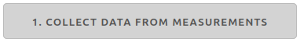
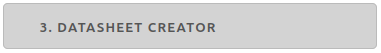

.. meta::
   :author: Jeff Candy and Claus Futtrup
   :keywords: speakerbench,loudspeaker,driver,parameter,file,zma,json,frd,design,calculator,impedance,measurement,simulation,software,free,audio
   :description: Speakerbench Documentation

.. title:: Speakerbench File Format Docs

============
File Formats
============

Speakerbench reads and creates a number of file formats which are summarized in :numref:`tab.fileformat`. The various Speakerbench JSON files are useful for organizing your project data into logically separate and convenient containers.

.. csv-table:: **File format summary**
   :align: center
   :header: *filetype*, *contents*, *format*, *link*
   :widths: 13,13,30,13
   :name: tab.fileformat

   ZMA, ASCII, raw impedance data, "`ZMA <#zma-file>`_"
   FRD, ASCII, raw SPL data,       "`FRD <#frd-file>`_"
   Z,   JSON,  Speakerbench impedance object,"`Z-file <#speakerbench-z-file>`_"
   ADV, JSON,  Speakerbench advanced parameter object,"`ADV-file <#speakerbench-adv-file>`_"
   SBD, JSON,  Speakerbench advanced driver object,"`SBD-file <#speakerbench-sbd-file>`_"
   TUNE, JSON, Speakerbench box tuning object,"`TUNE-file <#speakerbench-tune-file>`_"
   PLT, JSON,  Speakerbench box output object,"`PLT-file <#speakerbench-plt-file>`_"

Speakerbench does not save any data on the server. Instead, data is handled in your browser and stored in `JSON format <https://en.wikipedia.org/wiki/JSON>`_. For typical usage there is no need to hand-edit JSON files as the usage will be seamless and hidden from the user.

.. note::
   For techical reasons, Speakerbench replaces spaces in JSON strings with an underscore. Handling of the replacement will be hidden from the user.

ZMA File
--------

For input of impedance measurements, Speakerbench requires files in `ZMA format <https://fileinfo.com/extension/zma>`_ format. ZMA format is similar to the `FRD file format <#frd-file>`_ and may consist of a header, where the first character of each header line is an asterisk (*), followed by rows of measurement points with each row containing three space-delimited columns: Frequency (Hz), Magnitude (Ohm), Phase angle (degrees). This format is sometimes named FMP.

.. code::

  ****************************************************
  * Some info here, e.g., FILE:L16RNX_0g_242_27mV.zma
  * INFO: More info here
  * Data: Frequency (Hertz), Impedance (ohms), Phase (degrees)
  ****************************************************
     10.000    +7.1179   +25.2241
    101.339    +9.2848   -37.0496
   1006.846    +7.1984   +17.8486
  10003.368   +18.9094   +44.9883

The header section is optional and may be up to 256 lines long. The input data must use a dot (.) as the decimal separator with **columns separated by spaces** not commas or tabs. Frequencies (rows) must be listed in increasing order. The actual data in the example above has been significantly shortened for brevity and should in practice contain several hundred data points. ZMA files must contain ASCII characters only.

.. warning::
   Special characters, like a degree symbol (°), are not allowed, not even in the header since Speakerbench import will choke on such data and the data import will fail.

When importing ZMA files into Speakerbench to collect measured impedance data, all three measurements must contain the same number of datapoints and ideally they should be at the same measurement frequencies (although minor deviations in frequency are acceptable without loss of accuracy). It is not recommended  to reduce the frequency range for some of the measurements. Note that ZMA upload is also allowed in the box modeler to compare external/measured data to the Speakerbench modeled impedance.

FRD File
--------

FRD stands for *Frequency Response Data* and was described by the now-defunct `FRD Consortium <https://web.archive.org/web/20060502042528/http://www.pvconsultants.com/audio/frdis.htm>`_. This format is also acknowledged at `fileinfo.com <https://fileinfo.com/extension/frd>`_. Like ZMA, FRD files may consist of a header, where the first character of each line is an asterisk (*), and followed by rows of measurement points with each row containing three space-delimited columns: Frequency, Magnitude (SPL dB),  Phase angle (degrees).

.. code::

  ****************************************************
  * Some info here, e.g., FILE:L16RNX_0g_242_27mV.frd
  * INFO: More info here
  * Data: Frequency (Hertz), SPL (dB), Phase (degrees)
  ****************************************************
      10.072   +81.4199    -0.1295
     100.475  +117.4328    +0.0022
    1002.062  +118.6441    -0.0002
   10093.406  +114.9486    +0.0003

Restriction on header length and other formatting restriction are exactly as described for `ZMA files <#zma-file>`_.

In Speakerbench, you may upload an FRD file (say, a measured driver or port SPL) into the box modeler.  The frequency response in the file is plotted alongside the simulated SPL. This allows you to compare the output of a physically built loudspeaker with the Speakerbench simulation, and (for example) to adjust losses (:math:`\qa`, :math:`\ql`, :math:`\qp`) to match real data.

Speakerbench Z-File
-------------------

This container is created by the Speakerbench impedance data collector

and includes the added mass values ``m1`` and ``m2`` together with 3 ZMA files (``z0``, ``z1`` and ``z2``) required for the added-mass calculation. Below is a structured view of the contents of sample Z-file. The file name is by convention ``Z_something.json``.

.. code::

  {
    "comments": "Write_something_here",
    "volt": 0.242,
    "m1": 8.017,
    "m2": 16.048,
    "z0": [
        [10.0,7.1179,25.2241],
        [10.199,7.1646,25.5729],
        ...
        [19999.564,27.1911,48.1313],
        [20000.0,27.1868,48.1256]
        ],
    "z1": [
        [10.0,7.1929,25.7824],
        [10.199,7.2537,26.1631],
        ...
        [19999.564,27.1904,48.1484],
        [20000.0,27.1923,48.1576]
        ],
    "z2": [
        [10.0,7.3166,26.3593],
        [10.2,7.3756,26.7591],
        ...
        [19999.56,27.1579,48.1346],
        [20000.0,27.1644,48.133]
        ]
  }

.. note::

   We recommend that the frequency points for all three measurements be the same.

Specifying a user comment is optional, but we strongly recommend inserting the name of the test object here; otherwise you may not have any way to identify the test object at a later time. Specifying the applied voltage during measurements is optional, but we also believe it is useful to record. Not all voltage levels will give you a good fit. Later you may compare fit results from measurements at different voltages.

Speakerbench ADV-File
---------------------

This container is created by the advanced model fitter

   

The fitted data contains only the information identified by the fitting procedure (plus comments). Here is a structured view of the content of such a JSON file (actual data are from the L16RNX just for the example). The file name is by convention ``ADV_something.json``.

.. code-block:: json

  {
    "comments": "Sample_data_for_SEAS_woofer",
    "volt": "0.242",
    "git": "76ff186",
    "date": "21/02/2020",
    "re": 5.7212,
    "leb": 0.1258,
    "l3": 0.5255,
    "le": 1.1774,
    "rss": 562.405,
    "ke": 0.0386,
    "bl": 7.0089,
    "mms": 14.8959,
    "r0": 1.714,
    "rms": 2.1101,
    "c0": 0.7849,
    "cms": 0.8403,
    "beta": 0.1034,
    "f0": 45.7839,
    "fs": 44.985,
    "error": "0.4251",
    "score": "EXCELLENT"
  }

The ``git`` key corresponds to the current git hashtag for the version of Speakerbench that was used for the fitting procedure. Thus, this should not be edited unless you manipulate the file, in which case we suggest that you change the hashtag to ``0``.

Speakerbench SBD-File
---------------------

This container is created by the advanced model fitter

The SBD-file contains all information necessary to describe a driver for Speakerbench simulations. Below is a structured view of the content of such a JSON file (actual data are from the L16RNX just for the example). The file name is by convention a ``SBD_something.json``.

.. code-block:: json

  {
    "manufacturer": "SEAS_Fabrikker_AS",
    "brand": "SEAS",
    "model": "H1488-08_(L16RNX)",
    "provider": "Claus_Futtrup",
    "date": "14/03/2020",
    "comments": "",
    "volt": "0.24227",
    "git": "f198998",
    "re": "5.72125",
    "leb": "0.125781",
    "rss": "562.405",
    "ke": "0.0386331",
    "le": "1.17742",
    "bl": "7.00892",
    "mms": "14.8959",
    "c0": "0.784866",
    "r0": "1.71396",
    "f0": "45.7839",
    "beta": "0.10336",
    "lambda": "0.57126",
    "sd": "103.869",
    "dd": "115.0",
    "cms": "0.840309",
    "rms": "2.11006",
    "l3": "0.525458",
    "qms": "1.99535",
    "qes": "0.490346",
    "qts": "0.393617",
    "fs": "44.985",
    "vas": "12.8604",
    "temp": "21.0",
    "pres": "1013.25",
    "ah": "30.0",
    "cs": "344.299",
    "rho": "1.19667",
    "xmax": "6.0",
    "error": "0.425136",
    "score": "EXCELLENT"
  }

The ``sd`` input is required and must be entered by the user as described in the :ref:`Create Datasheet` section. Brand and Model are also required and must be entered by the user, conveniently stored at the beginning of the file so that you can open a SBD file in a text editor and identify the test object. ``temp``, ``pres`` and ``ah`` (air temperature, air pressure and relative air humidity respectively) are defaults but you can edit to reflect your actual measurement conditions. 0Some inputs are optional, for example ``xmax`` is optional (set to zero if the information is not available). Specifying ``xmax`` adds additional functionality to Speakerbench. See below description for the Thiele/Small Datasheet for details. In the SBD-file all numbers are stored as strings (see the legacy Thiele/Small section below).

``error`` (the fit error) and ``score`` (the fit score) are provided by the fit process and are optional. These values are omitted in the  `Loudspeaker Database <https://loudspeakerdatabase.com>`_, for example. Note the distinction between manufacturer and brand. For example brand name SB Acoustics are manufactured by Sinar Baja Electric Co. Ltd. Some brands have several manufacturing sites.

Legacy Thiele/Small option
..........................

Speakerbench can work with standard Thiele/Small datasheets. The key is to set the ``comments`` key to either ``ts1`` or ``ts2`` which implies there are two methods supported by Speakerbench. The first method is to accept the :math:`Q`-values and other Thiele/Small parameters as input and calculate the mechanical parameters. The second method is to accept the mechanical parameters (``cms``, ``mms``, ``rms`` and so on) and calculate the :math:`Q`-values, etc. The file contains the same keywords as a standard datasheet (see previous section) and the file name is unchanged; ``SBD_something.json``. Here is a structured view of the content of such a JSON file, with comments (which should obviously not be typed into the JSON file).

.. code:: 

  {
    "manufacturer": "",  - optional
    "brand": "Brand",    - required
    "model": "Model",    - required
    "provider": "Name",  - optional
    "date": "",          - optional, format: DD/MM/YYYY (consider at least a 'year' specification here, for some revision control)
    "comments": "ts2",   - ts1 or ts2 activates Thiele/Small simulations, as explained above
    "volt": "",          - optional, this is the voltage used for measuring the data (might be unknown)
    "git": "0",        - set to 0 when datasheet is not created by Speakerbench itself (through measurements, upload and fitting data)
    "re": "3.1",       - required in both cases (ts1 or ts2)
    "leb": "0.0",      - set to 0 when not using advanced parameters ... or set = l3 inductor, any value here is overwritten when activating ts1 or ts2
    "rss": "0.0",      - set to 0 when not using advanced parameters ... any value is overwritten
    "ke": "0.0",       - set to 0 when not using advanced parameters
    "le": "0.0",       - set to 0 when not using advanced parameters
    "bl": "5.4",       - required in both cases (ts1 or ts2)
    "mms": "12.3",     - required for ts2 (for ts1 this value is calculated, any value here is overwritten)
    "c0": "0.0",       - set to 0 when not using advanced parameters ... or set = cms, any value here is overwritten (by cms)
    "r0": "0.0",       - set to 0 when not using advanced parameters ... or set = rms, any value here is overwritten (by rms)
    "f0": "0.0",       - set to 0 when not using advanced parameters ... or set = fs, any value here is overwritten (by fs)
    "beta": "0.0",     - set to 0 when not using advanced parameters
    "lambda": "0.0",   - this field is calculated based on beta, any value here is overwritten
    "sd": "104.0",     - required in both cases (ts1 or ts2)
    "dd": "0.0",       - this field is calculated when sd is specified (push the APPLY button after data import)
    "cms": "1.3",      - required for ts2 (for ts1 this value is calculated, any value here is overwritten)
    "rms": "1.54",     - required for ts2 (for ts1 this value is calculated, any value here is overwritten)
    "l3": "0.32",      - required but can be zero - it is the classical voice coil inductance, Le, identified at the +3 dB point
    "qms": "2.18357",  - required for ts1 (for ts2 this value is calculated, any value here is overwritten)
    "qes": "0.357488", - required for ts1 (for ts2 this value is calculated, any value here is overwritten)
    "qts": "0.307195", - required for ts1 (for ts2 this value is calculated, any value here is overwritten)
    "fs": "36.4074",   - required for ts1
    "vas": "0.0",      - required for ts1 (for ts2 this value is calculated, any value here is overwritten)
    "temp": "20.0",    - required, this is ambient temperature for the input data and calculations
    "pres": "1013.25", - required, this is air pressure for the input data and calculations
    "ah": "30.0",      - required, this is relative air humidity for the input data and calculations
    "cs": "343.684",   - required, this is the speed of sound for the input data and calculations
    "rho": "1.20095",  - required, this is the density of air for the input data and calculations
    "xmax": "6.0",     - optional
    "error": "0",      - optional, set to 0 when not using advanced parameters
    "score": ""}       - optional, set to "" (empty string) when not using advanced parameters
  }

An online internet database at `Loudspeakerdatabase.com <https://loudspeakerdatabase.com>`_ by Cristian Pop provides access to more than **4000** Thiele/Small datasheets and lets you download a Speakerbench SBD-file which you can import directly into the :ref:`Creator app<Create Datasheet>`.

Speakerbench TUNE-File 
----------------------

This container is created by the box simulator

Speakerbench allows you to download your box tuning parameters into a TUNE-file, and also to upload a TUNE-file to configure the box simulator with saved settings. Below is a structured view of the contents of a TUNE-file. The file name is by convention a ``TUNE_something.json``.

.. code::

  {
    "eg": 2.83,
    "fp": "43.1856",
    "vb": "8.302388637830859",
    "dp": 2,
    "qp": "50.0",
    "qa": "100.0",
    "ql": "100.0",
    "delta": "1.0",
    "port": "classic",
    "mybox": "Beranek",
    "gain": 0,
    "fmax": 10000,
    "nfreq": 256,
    "time": false,
    "lxlz": 1,
    "lylz": 1,
    "ydrv": 0.5,
    "yprt": 0.2
    "filt": false,
    "ls": "0",
    "rs": "0",
    "cp": 8.2,
    "rcp": 12,
    "tname": null
  }

Speakerbench PLT-File
---------------------

This container is created by the box simulator

You may download data suitable for plotting by clicking the hotlink in the Info tab in the box simulator. The file name is by convention a ``PLT_something.json``. Data in the PLT-file is suitable for import into other software (e.g. Python, MATLAB, Scilab, etc.). At the moment we only export impedance and frequency response graphs, and the step response (if enabled).
The first part of the PLT-file contains the associated TUNE parameters, and hereafter each vector is listed.

.. code::

  {
   "tune": {
            "eg": "2.83",
            "fp": "44.985",
            "vb": "9",
            "dp": 2,
            "qp": "50.0",
            "qa": "100.0",
            "ql": "100.0",
            "delta": "1.0",
            "port": "classic",
            "mybox": "classic",
            "gain": 0,
            "fmax": 10000,
            "nfreq": 256,
            "time": false,
            "lxlz": 1,
            "lylz": 1,
            "ydrv": 0.5,
            "yprt": 0.2,
            "filt": false,
            "ls": "0",
            "rs": "0",
            "cp": 8.2,
            "rcp": 12,
            "tname": null
           },
   "f": [10.0, 10.274594854461801, 10.556729942333291, 10.84661231454405, ... Frequencies (x-axis)
   "zr": [6.599962244456647, 6.646636565126652, 6.696883970134817, ... Impedance (real part)
   "zi": [3.2720668973939393, 3.3746003068278956, 3.4816407218158365, ... Impedance (imaginary part)
   "pbr": [40.60417233010611, 44.45606775186855, 48.63231865096523, ... System response (real part)
   "pbi": [-43.00746681361694, -48.33353199841675, -54.32547924681456, ... System response (imag part)
   "ppr": [-887.440121332069, -920.7345590795712, -954.535384874747, ... Port response (real part)
   "ppi": [797.4756133372156, 852.8593910226134, 912.0298455044954, ... Port response (imag part)
   "pcr": [-846.835949001963, -876.2784913277025, -905.9030662237818, ... Cone response (real part)
   "pci": [754.4681465235986, 804.5258590241966, 857.7043662576809, ... Cone response (imag part)
   "stp": [1.1488835855248908e-05, 0.023278708057592145, 0.07023348335289976, ... Step response, pressure in Pascal
   "tms": [5.561953196364498e-07, 0.0014606669152475028, 0.0057292122006382395, ... Step response, time in milliseconds (x-axis)
  }

All graphs with complex data are exported in cartesian (real,imag) format. The ``tms`` (time in milliseconds) and ``stp`` vectors only show up if you enable plotting of the step response.
