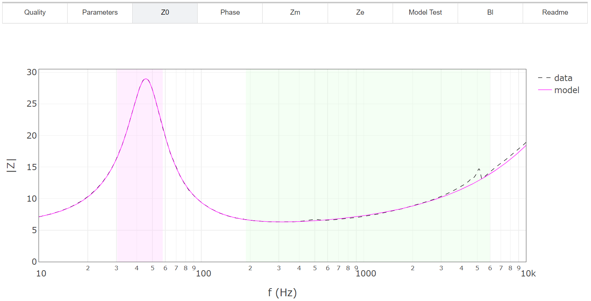
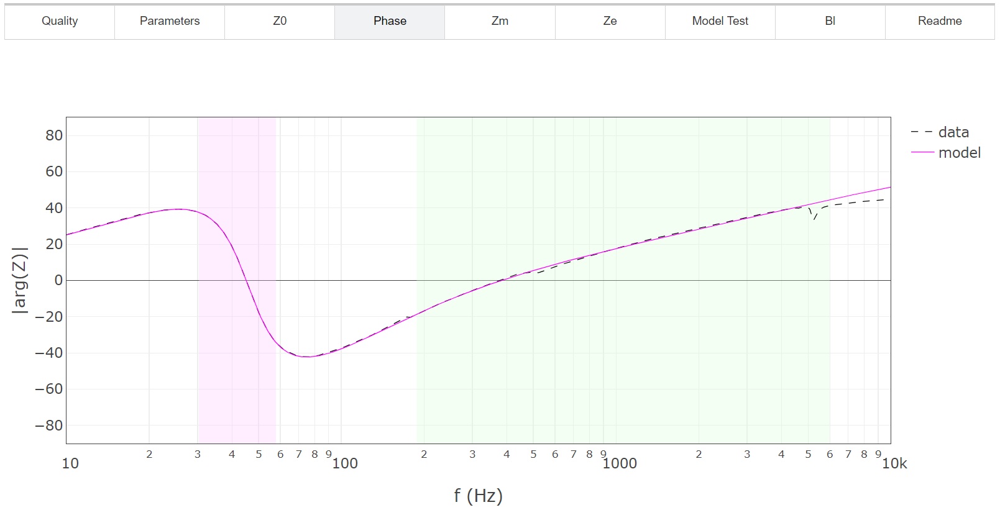
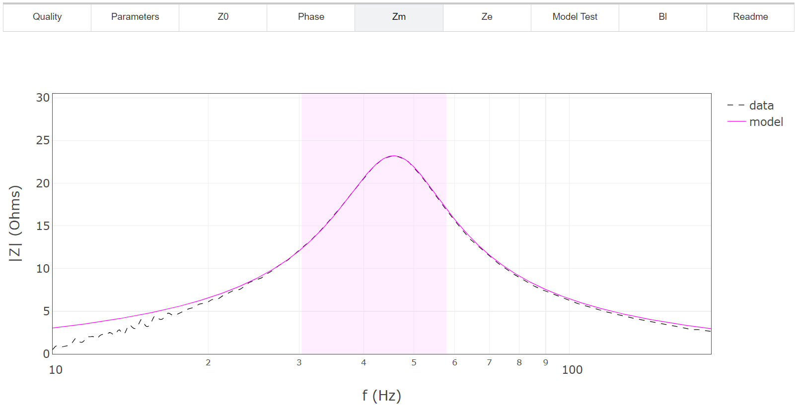
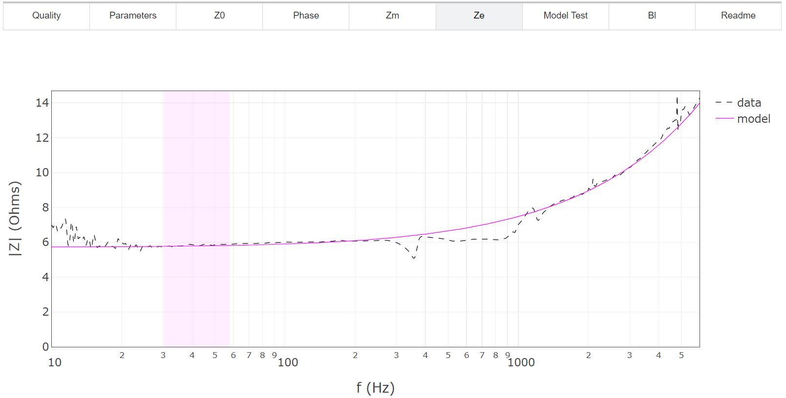
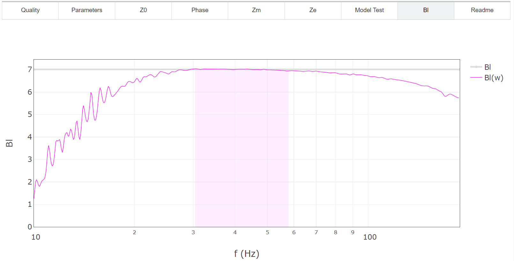
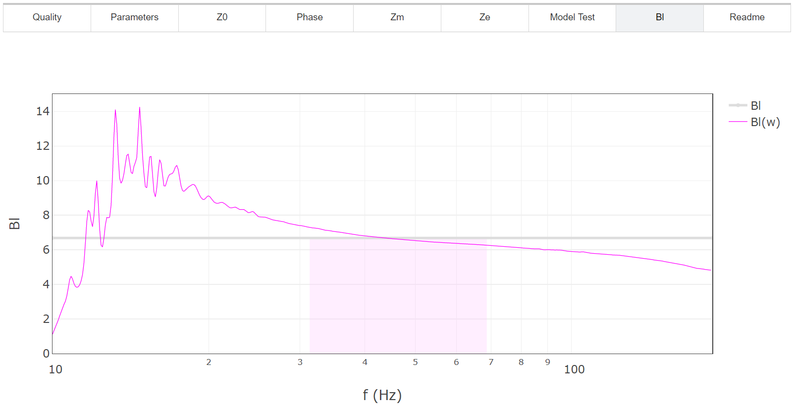
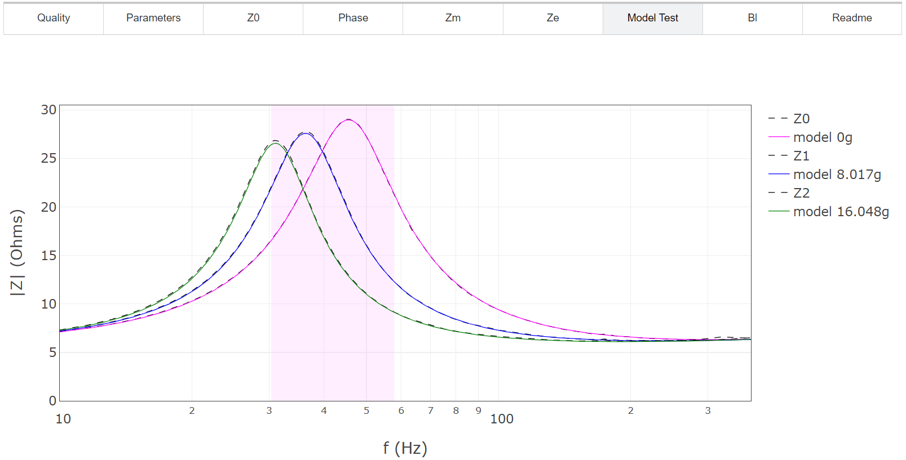
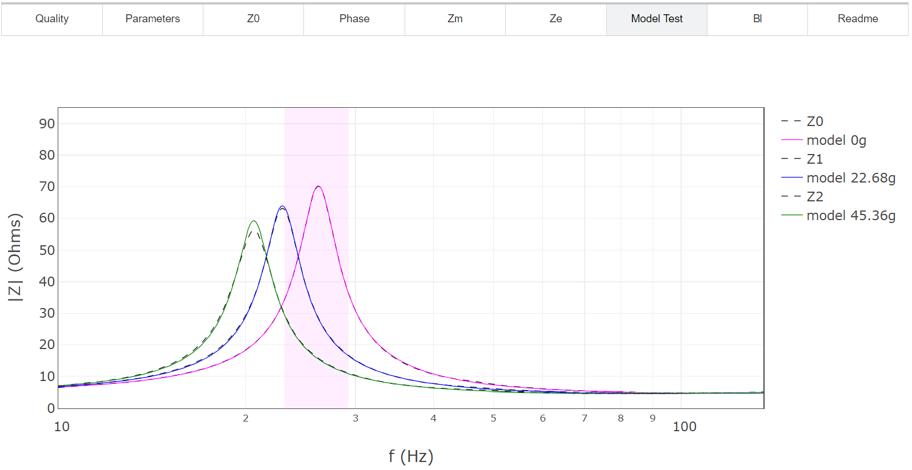
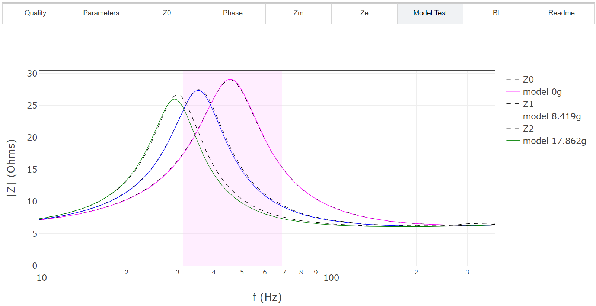

.. meta::
   :author: Jeff Candy and Claus Futtrup
   :keywords: speakerbench,loudspeaker,driver,parameter,json,design,calculator,impedance,measurement,simulation,software,free,audio
   :description: Speakerbench Documentation

==================
Advanced Model Fit
==================

.. note::
   **STEP 2**: This section will show you how to fit the Z-file data from :doc:`STEP 1 <collect>` into a parameter file (ADV-file).

This app uses the data stored in the previously generated JSON data container to generate a nonlinear fit to the advanced driver model. The free-air impedance in this model is given by

.. math::
   :label: eq.ztot
	   
   Z = \re + s \leb + \left( \frac{1}{\rss} + \frac{1}{s \le}
   + \frac{1}{\sqrt{s} \ke} \right)^{-1} + \frac{\bls}{\mathbb{Z}_{\rm mot}} \; ,

where :math:`\mathbb{Z}_{\rm mot}` is the mechanical impedance of the transducer

.. math::
   :label: eq.zmot
	   
   \mathbb{Z}_{\rm mot} = s \mms + R_0 + \displaystyle \frac{1}{s C_0 \left[ 1+\beta\ln(1+\omega_0/s)\right]} \; .

The equivalent electrical circuit for the driver in free air is

.. subfigure:: A
   :name: fig.elec_total
   :width: 60%
   :align: center

   .. image:: images/elec_total.png

   Electrical-equivalent circuit for transducer in free air, where :math:`\mathbb{Z}_{\rm mot}`
   is the mechanical impedance of the suspension

The parameter :math:`\omega_0` is a transition frequency, chosen to be :math:`\omega_0 = 1.5 \, \ws = 3 \pi \fs`, such that :math:`\fs` (the driver resonant frequency in Hz) will be determined by the fitting process. Some aspects of the *dual-added-mass* algorithm are described in our 2017 AES article :cite:`candy:2017`, whereas other aspects are proprietary. The fit procedure is complicated, but provides a robust and accurate estimation of the model parameters. The advanced model utilizes what we consider to be the best analytic forms for both the *electrical impedance* (the
Thorborg-Futtrup inductance model :cite:`thorborg:2011`) and the *mechanical impedance* (the Knudsen-Jensen LOG model of viscoelasticity :cite:`knudsen:1993`), with the added Retardation Spectra function as described by Agerkvist and Ritter :cite:`agerkvist:2010`. The fit parameters are suitable for high-accuracy loudspeaker box simulations (for designing loudspeaker systems). Please note that all information (including input variables and results) is stored in your browser and nothing is saved to the server (not even temporary data). At the end you should export the data and save the results to your local hard drive. If you don't and close the browser window, the data will be lost.

To compute the fit, simply upload the JSON container of the previous section into the app. The fit analyzes your data and the fit result and provides you with a quality rating: Excellent, Good, Fair or Sorry.

We published an article in the *Loudspeaker Industry Sourcebook 2020* about Speakerbench :cite:`LIS:2020` which explains some aspects of the fitting and how to analyze the results, with some key points that you can read in the section below. More background information can be found in our ALMA International Symposium 2017 presentation :cite:`futtrup:2017`.

Analyzing fit results
---------------------

The console of the fit shows error metrics, which gives you (or at least us) an indication of what part of the fit was successful and (potentially) what part wasn’t. Additional tabs contain information about the calculated advanced parameters and equivalent traditional T-S parameters. Beyond the computed parameters, we provide numerous function plots for diagnostic purposes: total impedance, phase, motional impedance, electrical impedance, and more. Next, we discuss some of these plots.

Unweighted impedance and phase: These plots present the most basic model-versus-data comparisons for the unweighted measurements; namely the complex impedance magnitude (see :numref:`fig.L16_z0`) and phase (see :numref:`fig.L16_phase`). In these plots, the magenta shaded region indicates the motional fit range and the green shaded area the electrical fit range. It is readily apparent that the fit quality for the advanced driver model is far beyond that achievable from the traditional T-S approach.

            Impedance magnitude shown for the SEAS L16RNX, comparing the model (magenta curve) against the original data (dashed line).

            Impedance phase is shown for the SEAS L16RNX, comparing the model (magenta curve) against the original data (dashed line).

Motional and electrical impedances: Extracting the motional and blocked-electrical impedances is a multiple-step process since neither can be measured directly. Untangling these two functions is highly problematic and the dual-added-mass approach was introduced to simplify this procedure.

By using three separate impedance measurements, it is possible to algebraically extract the motional impedance without any assumption about the creep compliance. For this reason, the motional impedance computed this way is referred to as the “model-free” motional impedance, :math:`Z_{M*}`. The 3PC compliance model is then fit to the model-free motional impedance over a narrow region around the driver resonance. A comparison of these two curves for the SEAS L16RNX is shown in :numref:`fig.L16_zmstar`, with excellent agreement over a wide frequency range (25 Hz to 100 Hz). Furthermore, the associated electrical impedance is shown in :numref:`fig.L16_ze`.

            Motional impedance is shown for the SEAS L16RNX, comparing the model (magenta curve) against the (extracted) data. Even though the motional impedance cannot be measured directly, the dual-added-mass method can extract the motional impedance (:math:`Z_{M*}`) from the total using the entire three-measurement dataset.

            Electrical impedance curves for the SEAS L16RNX compare the model (magenta curve) against the (extracted) electrical impedance data :math:`Z_E = Z - Z_{M}`. The data curve indicates the presence of driver resonances outside the scope of the model, as well as measurement artifacts.

The Bl force factor (motor strength): The model-free motional impedance extraction process allows us to algebraically compute a diagnostic Bl-curve. This is not to be interpreted as a Bl-versus-frequency dependence that exists in real life, as the force factor (Bl) should be a single value. Given the three impedance curves, we calculate a Bl estimate for each frequency separately. Ideally, this curve should be flat through the focus area around the resonance frequency in free air, and if that’s fulfilled, and the overall fit looks good too, then the average value will represent a very precise identification of the true Bl-value (see :numref:`fig.L16_bl`).

            Diagnostic Bl-versus-frequency curve for the SEAS L16RNX. The constancy of this curve over the shaded region gives an indication of overall quality of the input data used for the subsequent fit. The grey horizontal line indicates the best estimate of Bl = 7.01 Tm based on simple average over the fit region.

However, if the curve has a slope, as illustrated in :numref:`fig.L16_DI_bad_blw`, then something in your measurements isn’t exactly right. Bear in mind that with these calculations we assume that the moving mass is a constant. This implies that radiation impedance (air load) is assumed to be constant in the frequency range of interest. So, constant mass means you cannot push your driver too hard, and if a driver has a stiff suspension and soft cone, such that the cone is bending and essentially is just as much part of the suspension, then these conditions are not met.

            Bl-versus-frequency curve for one of the discarded cases from our Gage R&R analysis. Within the focus area, the Bl variation of 6.2-7.3 Tm is too big a window (±8%) to guarantee that Bl is determined with acceptable precision.

If the anomaly is of fairly mild character, you can still get a good measure of the Bl-value, but depending on the anomaly, then additional tolerances are implied. If the Bl-curve has a strangely nonlinear character and doesn’t pass through the estimated average Bl-value at the resonance frequency, but seems off, then it’s a clear sign of a faulty measurement. Please check that your added masses are securely attached and their movement essentially follows the voice coil’s movement.

Model test: Speakerbench also generates a key performance test, in which model predictions of impedance are plotted for (1) the computed value of :math:`M_{MS}`, (2) :math:`M_{MS} + m_1`, and (3) :math:`M_{MS} + m_2`. These three model curves are then overlayed with the raw data. If you see three curves neatly on top of three dashed lines, then the fit (solid lines) agree nicely with your measurements (dashed lines), as shown in :numref:`fig.L16_fit`. We focus on the free-air measurement without added mass, so most likely the first deviations you’ll see are for the measurement with the highest amount of added mass. Here measurement and simulation might deviate by the peak of the impedance, or alternatively one of the slopes.

            The model performance test compares model prediction of all three impedance measurements against original data. Shown are the unweighted case (magenta), the case with added mass :math:`m_1` (blue) and the case with added mass :math:`m_2` (green). The difference in peak height between the three measurements is due to frequency-dependent damping and is a consequence of viscoelasticity.

If the peak impedance for the curve with the highest amount of added mass is measured lower than simulated (as shown in :numref:`fig.sb29_fit`), the reason could be that you’re not entirely in the small-signal domain. What might cause this is if the speaker is moving at a fairly high excursion and some increase in stiffness at the extremes causes the driver to brake, which causes a higher draw of current from the amplifier, which is then reflected as lower impedance in your measurement. The solution may be to reduce the input voltage (perhaps try half the voltage, equal to one quarter the input power).

            In this example of a 10” woofer, driven with an additional 45.4 grams of added-mass at 500 mV, we see that the dashed curve peaks a bit less than what was predicted by the linear model (green solid curve). The deviation is not significant and this particular fit is still qualified as GOOD, but not excellent.

If there’s a gap between measurement and fit down the sides of the peak above the individual resonance frequencies as shown in :numref:`fig.L16_DI_bad_fit`, then this could be another alarming observation which could disqualify the measurement or the fit. We’re not so worried if the deviation is below the lowest resonance frequency and we can expect sometimes to see some deviations “creep” in here. The desire for a good fit at higher frequencies is due to our focus on box simulations and this means the fit should look good here, which again means the data and fit is suitable for extrapolation into the higher frequency range (because the resonance of the speaker in the box is normally higher than the free-air resonance frequency).

            This example of the SEAS L16RNX is one of the discarded measurements from the Gage R&R analysis of our Audio Engineering Society (AES) paper. We suspect the :math:`m_2` added-mass was not properly attached. The large difference between measurement and simulation inside the focus area (purple rectangle) is a clear indication of a bad fit or a bad set of input data.

With these examples you are equipped with know-how to analyze your own fit results.