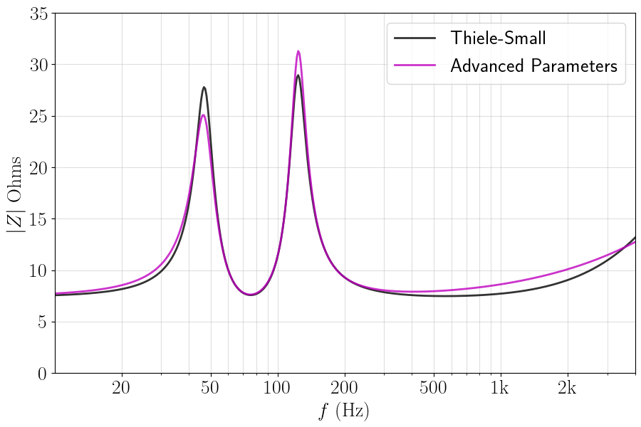

.. meta::
   :author: Jeff Candy and Claus Futtrup
   :keywords: speakerbench,loudspeaker,driver,parameter,json,design,calculator,impedance,measurement,simulation,software,free,audio
   :description: Speakerbench Documentation

Speakerbench
============

`Speakerbench <https://www.speakerbench.com>`_ is a free, web-based application for modeling loudspeakers. A novel feature of the software is the use of an **advanced transducer model** that includes motor semi-inductance and suspension viscoelasticity.

Why Speakerbench?
-----------------

.. figure:: images/speaker_scaled.png
            :width: 20 %
	    :alt: speaker
	    :align: left

The corrections to the traditional Thiele-Small approach resolve a long-standing problem with incorrect prediction of impedance, and not least the maxima in vented systems.

            The advanced model (magenta) correctly predicts the impedance peak offset for
	    a woofer in a vented box. Classical Thiele-Small theory (black) misses this effect.

With a better prediction of the impedance, you can build the loudspeaker and verify that your design is as intended with impedance measurements, not just the port tuning frequency but also the overall losses of the system.

The impedance is overall simulated correctly, which also implies the power dumped into the speaker (for a given input voltage) is correct, and the output power response is correctly simulated, also at high frequencies.

Speakerbench workflows are separated into 4 apps:

**Collect**
   Merge three impedance measurements into a json data container

**Fit**
   Analyze impedance data container to compute advanced model parameters

**Create**
   Create a standard driver datasheet

**Box**
   Simulate the system response in an enclosure

Speakerbench doesn't do the actual impedance measurements for you; rather, you will need to do this with external hardware as outlined in this document.

.. toctree::
   quickstart
   :hidden:

.. toctree::
   :caption: Impedance
   :hidden:

   measure
   collect
   fit

.. toctree::
   :caption: Box Modeling
   :hidden:

   create
   box
   box_theory

.. toctree::
   :caption: Resources
   :hidden:

   alignment
   sampledata
   youtube
   json-docs
   zreferences
